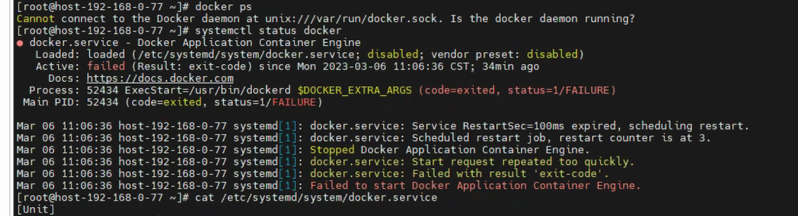
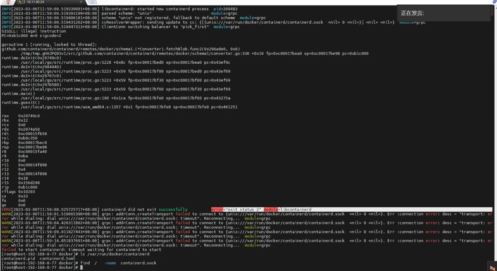
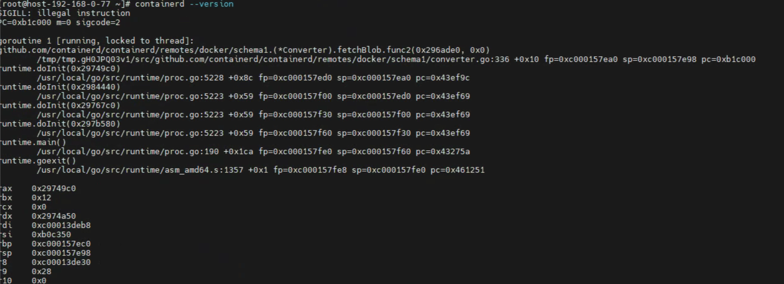

---
kind:
  - Troubleshooting
products:
  - Alauda Container Platform
  - Alauda DevOps
  - Alauda AI
  - Alauda Application Services
  - Alauda Service Mesh
  - Alauda Developer Portal
ProductsVersion:
  - 4.1.0,4.2.x
---
<!-- A type of document that involves encountering a fault, diagnosing it, performing root cause analysis, and providing solutions. -->

# docker无法启动

docker.service: Start request repeated too quickly. docker.service: Failed with result 'exit-code' Failed to connect to /var/run/docker/containerd/containerd.sock, file not found

## Cause
- containerd binary file (/user/bin/containerd) is corrupted or inconsistent with normal nodes

## Resolution
- Copy containerd binary from a normal node to /user/bin/containerd on affected node
- chmod +x /user/bin/containerd
- systemctl restart docker

## [workaround]

## [Related Information]
**Screenshots**

- Environment: 通用
- /var/run/docker/containerd/containerd.sock
- /user/bin/containerd
- docker.service
- daemon.json
- Component: Docker
- Page ID: 140807583
- Original Title: docker无法启动
