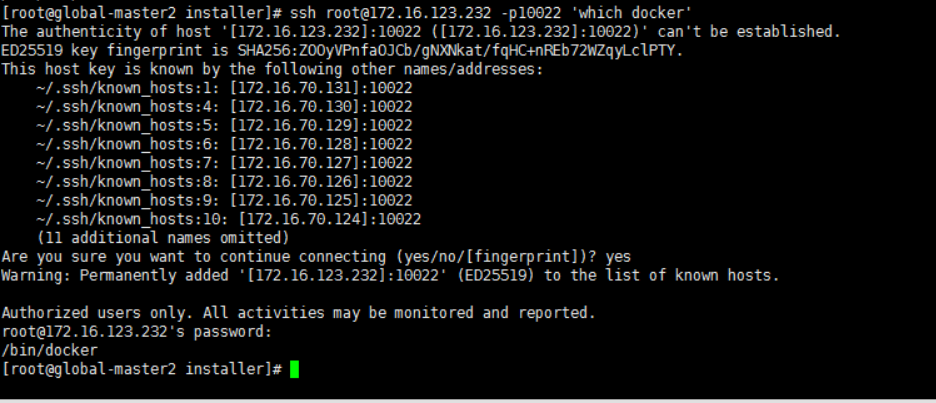

---
kind:
  - Troubleshooting
products:
  - Alauda Container Platform
  - Alauda DevOps
  - Alauda AI
  - Alauda Application Services
  - Alauda Service Mesh
  - Alauda Developer Portal
ProductsVersion:
  - 4.1.0,4.2.x
---
<!-- A type of document that involves encountering a fault, diagnosing it, performing root cause analysis, and providing solutions. -->

# 添加节点报错/bin/docker不在/usr/bin下

添加节点报错可用性检查未通过，提示/bin/docker，/bin/containerd，/bin/runc不在/usr/bin下 ssh远程执行'which docker'返回/bin/docker

## Cause
- 检查项使用交互式shell方式加载环境变量，但用户仅在/etc/profile中修改PATH变量（登录shell加载）

## Resolution
- 在~/.bashrc或/etc/bash.bashrc中添加PATH环境变量配置（确保/usr/bin在/bin前）

## [workaround]

## [Related Information]
**Screenshots**

- Environment: 3.10.x
- /bin/docker
- /bin/containerd
- /bin/runc
- /etc/profile
- ~/.bashrc
- /etc/bash.bashrc
- Component: Docker
- Page ID: 140815719
- Original Title: 添加节点报错/bin/docker不在/usr/bin下
