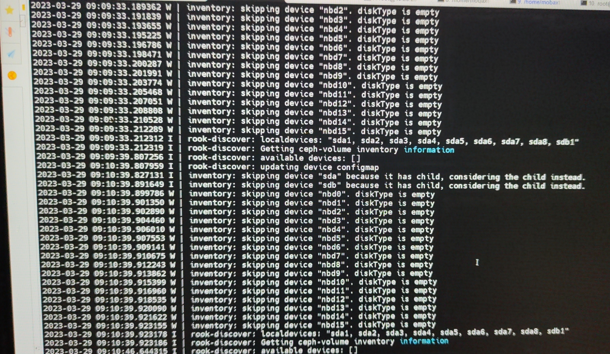
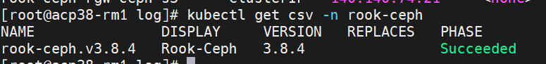
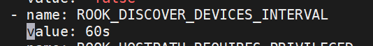

---
kind:
  - Troubleshooting
products:
  - Alauda Container Platform
  - Alauda DevOps
  - Alauda AI
  - Alauda Application Services
  - Alauda Service Mesh
  - Alauda Developer Portal
ProductsVersion:
  - 4.1.0,4.2.x
---
<!-- A type of document that involves encountering a fault, diagnosing it, performing root cause analysis, and providing solutions. -->

# docker目录达到阈值被驱逐，是由于rook

docker目录达到驱逐阈值导致触发驱逐，业务中断 /var/lib/docker/overlay2下rook-discover日志文件过多

## Cause
- rook-discover探测间隔设置为60秒导致日志高频输出
- 容器日志未配置自动清理机制

## Resolution
- 修改rook-ceph operator的ROOK_DISCOVER_DEVICES_INTERVAL参数为3600s
- 重启rook-ceph-operator和rook-discover容器

## [workaround]

## [Related Information]
**Screenshots**

- Environment: rook-ceph环境，docker目录存储空间达到阈值，rook-discover日志高频输出场景
- rook-discover
- rook-ceph-operator
- ROOK_DISCOVER_DEVICES_INTERVAL
- /var/lib/docker/overlay2
- Component: Docker
- Page ID: 140827291
- Original Title: docker目录达到阈值被驱逐，是由于rook-discover
