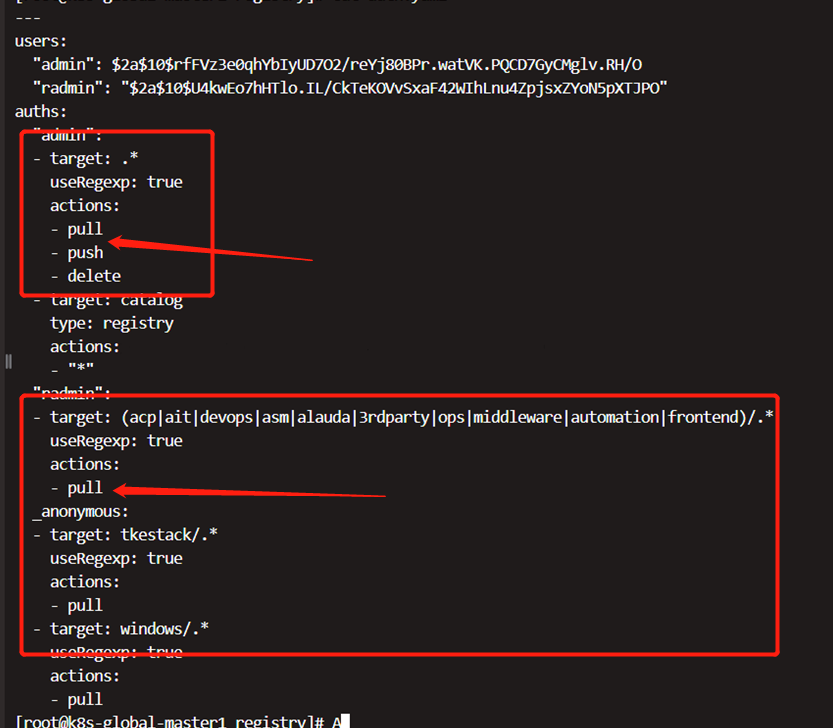

---
kind:
  - Troubleshooting
products:
  - Alauda Container Platform
  - Alauda DevOps
  - Alauda AI
  - Alauda Application Services
  - Alauda Service Mesh
  - Alauda Developer Portal
ProductsVersion:
  - 4.1.0,4.2.x
---
<!-- A type of document that involves encountering a fault, diagnosing it, performing root cause analysis, and providing solutions. -->

# 替换平台组件镜像，docker pull无法上传

docker pull 无法上传，报错permission denied

## Cause
- 使用了非admin账号进行上传操作

## Resolution
- 使用admin账号上传，密码直接使用明文无需base64解密

## [workaround]

## [Related Information]
**Screenshots**

- Environment: Kubernetes集群镜像仓库
- /etc/kubernetes/registry/auth.yaml
- 镜像仓库账号
- Component: Docker
- Page ID: 144902505
- Original Title: 替换平台组件镜像，docker pull无法上传
