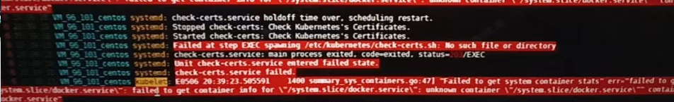
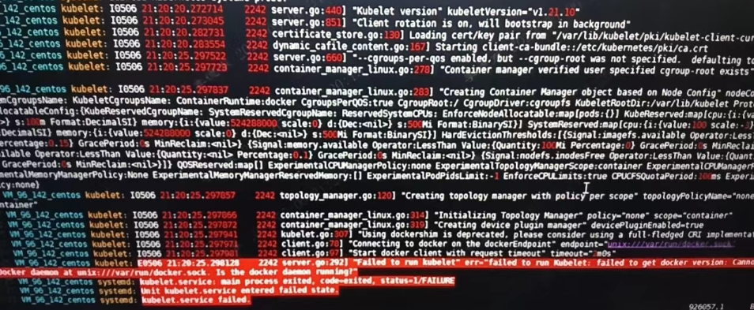
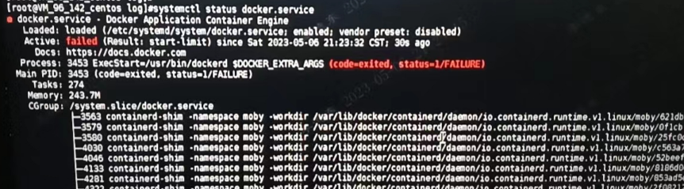

---
kind:
  - Troubleshooting
products:
  - Alauda Container Platform
  - Alauda DevOps
  - Alauda AI
  - Alauda Application Services
  - Alauda Service Mesh
  - Alauda Developer Portal
ProductsVersion:
  - 4.1.0,4.2.x
---
<!-- A type of document that involves encountering a fault, diagnosing it, performing root cause analysis, and providing solutions. -->

# 集群异常

节点状态为NotReady kubelet运行异常 docker重启失败

## Cause
- /etc/docker/daemon.json文件存在语法错误（镜像仓库设置部分多出双引号）

## Resolution
- 修正/etc/docker/daemon.json配置错误
- 执行systemctl restart docker重启服务

## [workaround]

## [Related Information]
**Screenshots**

- Environment: 通用
- /etc/kubernetes/check-certs.sh
- kubelet日志
- docker服务
- /etc/docker/daemon.json
- Component: Docker
- Page ID: 146360526
- Original Title: 集群异常-节点docker配置文件错误导致
