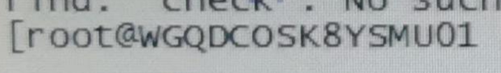
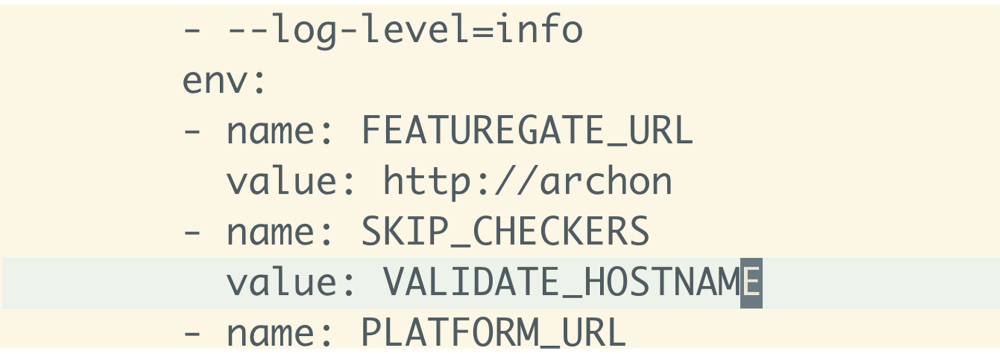

---
kind:
  - Troubleshooting
products:
  - Alauda Container Platform
  - Alauda DevOps
  - Alauda AI
  - Alauda Application Services
  - Alauda Service Mesh
  - Alauda Developer Portal
ProductsVersion:
  - 4.1.0,4.2.x
---
<!-- A type of document that involves encountering a fault, diagnosing it, performing root cause analysis, and providing solutions. -->

# 3.12

添加节点报主机名不满足要求 主机名以大写字母开头

## Cause
- 主机名以大写开头不符合命名规范

## Resolution
- 进入minioalauda容器: docker exec -ti xxxxxxxx
- 修改tke-platform-api的Deployment: kubectl edit deploy -n cpaas-system tke-platform-api
- 添加环境变量参数: - name: SKIP_CHECKERS
  value: VALIDATE_HOSTNAME
- 通过kubectl apply加载修改后的yaml(容器内无法编辑时)

## [workaround]

## [Related Information]
**Screenshots**

- Environment: 3.12
- tke-platform-api
- cpaas-system
- SKIP_CHECKERS
- VALIDATE_HOSTNAME
- Component: Docker
- Page ID: 152658923
- Original Title: 3.12-部署集群主机名不符合要求
