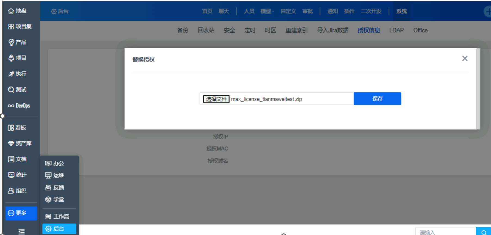

---
kind:
  - Troubleshooting
products:
  - Alauda Container Platform
  - Alauda DevOps
  - Alauda AI
  - Alauda Application Services
  - Alauda Service Mesh
  - Alauda Developer Portal
ProductsVersion:
  - 4.1.0,4.2.x
---
<!-- A type of document that involves encountering a fault, diagnosing it, performing root cause analysis, and providing solutions. -->

# 部署禅道

安装禅道时设置账号步骤卡住 容器日志提示用户密码错误 界面显示版本授权过期无法进入系统

## Cause
- 禅道版本授权文件过期
- 未授权状态下无法通过常规途径更新授权文件

## Resolution
- 将新版授权文件解压后覆盖到服务器 zentao/config/license/ 目录
- 重新执行安装流程

## [workaround]

## [Related Information]
**Screenshots**

- Environment: 禅道3.12版本 Docker容器化部署
- zentao/config/license/
- Docker部署
- 禅道3.12版本
- Component: Docker
- Page ID: 163081948
- Original Title: 部署禅道-未授权问题
