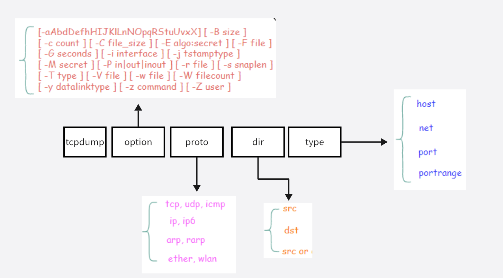

---
kind:
  - Troubleshooting
products:
  - Alauda Container Platform
  - Alauda DevOps
  - Alauda AI
  - Alauda Application Services
  - Alauda Service Mesh
  - Alauda Developer Portal
ProductsVersion:
  - 4.1.0,4.2.x
---
<!-- A type of document that involves encountering a fault, diagnosing it, performing root cause analysis, and providing solutions. -->

# Tcpdump抓包指导

tcpdump工具介绍 **tcpdump 的参数组成**

## Cause
- * `[.]` : 没有 Flag （意思是除上面四种类型外的其他情况，有可能是 ACK 也有可能是 URG）

## Resolution
- 1. option 可选参数：各类可选参数，后续根据使用场景摘取进行说明。
- 4. direction 类过滤器：根据数据流向进行过滤，可识别的关键字有：src, dst，同时你可以使用逻辑运算符进行组合，比如 src or dst
- 使用 tcpdump 抓包后，会遇到的 TCP 报文 Flags，有以下几种：
- 使用 host 就可以指定 host ip 进行过滤
- 使用 port 就可以指定特定端口进行过滤
- 1. 去erebus所在集群执行 kubectl get pod -n cpaas-system -owide |grep erebus 获取到erebus 所在节点ip
- 2. ssh到erebus 所在节点，执行 docker ps -a|grep erebus 或者crictl ps -a| grep erebus 拿到容器id
- 3. docker inspect <容器id> |grep Pid 拿到pid
- 5. 使用tcpdump开始抓包，tcpdump -i eth0 -nnev > erebus.pcap
- 备注：命令内容，使用 tcpdump 工具在 eth0 网络接口上进行数据包捕获，并以不将地址转换为名字（-n）、更详细的输出（-v）、显示以太网头部（-e）的方式进行，将捕获的结果重定向（>）保存到名为 erebus.pcap 的文件中。

## [workaround]

## [Related Information]
**Screenshots**

- 20
- 192
- 168
- 10
- 49
- 172
- 8088
- 21
- 26
- 100
- Component: Docker
- Page ID: 217547146
- Original Title: Tcpdump抓包指导
