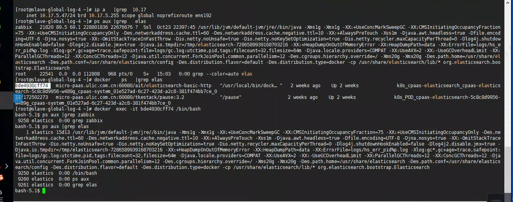

---
kind:
  - Troubleshooting
products:
  - Alauda Container Platform
  - Alauda DevOps
  - Alauda AI
  - Alauda Application Services
  - Alauda Service Mesh
  - Alauda Developer Portal
ProductsVersion:
  - 4.1.0,4.2.x
---
<!-- A type of document that involves encountering a fault, diagnosing it, performing root cause analysis, and providing solutions. -->

# ACP生产环境日志节点进程问题

zabbix用户下存在疑似ES日志服务的进程

## Cause
- 非zabbix服务的进程以zabbix用户身份运行
- 可能由Docker容器启动的进程未正确配置用户映射

## Resolution
- 1. 检查进程树确认父进程来源
ps -ef --forest
2. 检查容器启动参数中的用户映射配置
3. 验证ES组件部署配置

## [workaround]
- 临时停止非授权进程：
kill -9 <PID>

## [Related Information]
**Screenshots**

- Environment: 3.12.2
- zabbix
- docker
- elasticsearch
- TKE组件
- 用户映射配置
- Component: Docker
- Page ID: 219090019
- Original Title: 容器平台-ACP生产环境日志节点进程问题-36540
