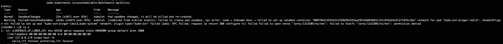

---
kind:
  - Troubleshooting
products:
  - Alauda Container Platform
  - Alauda DevOps
  - Alauda AI
  - Alauda Application Services
  - Alauda Service Mesh
  - Alauda Developer Portal
ProductsVersion:
  - 4.1.0,4.2.x
---
<!-- A type of document that involves encountering a fault, diagnosing it, performing root cause analysis, and providing solutions. -->

# kube

kube-ovn-cni报错 Docker运行时下的Pod启动失败

## Cause
- 权限问题导致
- 缺少SYS_PTRACE capability

## Resolution
- kube-ovn-cni ds下增加capability SYS_PTRACE

## [workaround]
- 将kube-ovn-cni设置为特权模式

## [Related Information]
**Screenshots**

- Environment: CNI版本: 1.12.21
- kube-ovn-cni
- DaemonSet
- SYS_PTRACE
- capabilities
- Component: Docker
- Page ID: 228557140
- Original Title: kube-ovn 权限问题导致docker  运行时下的pod 启动失败
