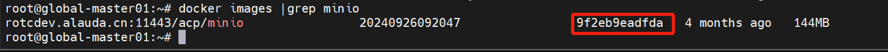
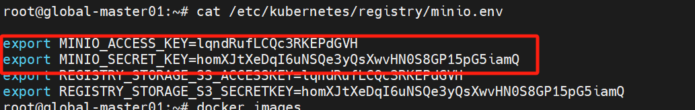

---
kind:
  - Troubleshooting
products:
  - Alauda Container Platform
  - Alauda DevOps
  - Alauda AI
  - Alauda Application Services
  - Alauda Service Mesh
  - Alauda Developer Portal
ProductsVersion:
  - 4.1.0,4.2.x
---
<!-- A type of document that involves encountering a fault, diagnosing it, performing root cause analysis, and providing solutions. -->

# registry

minio日志报错：Drive <https://172.16.58.51:9000/volume2> returned an unexpected error: file access denied minio日志提示：Unable to use the drive <https://172.16.58.51:9000/volume1>: drive not found INFO: Waiting for all other servers to be online to format the drives

## Cause
- minio节点驱动器访问权限异常（file access denied）
- minio节点驱动器路径配置异常（drive not found）
- 超过2个minio节点故障导致无法满足高可用quorum

## Resolution
- 确保registry三个pod处于4/4 running状态
- 备份并重置minio目录：mv /cpaas/minio /cpaas/minio-back
- 执行命令重建mc alias：docker run --name mctmp --privileged --net=host --entrypoint=/bin/sh -v $PWD/[registry:/registry ${MINIO_IMAGE_ID} -c 'mc --insecure alias set miniocluster ${MASTER1IP:9000} ${MINIO_ACCESS_KEY} ${MINIO_SECRET_KEY}'

## [workaround]

## [Related Information]
**Screenshots**

- Environment: 3.18.1
- 9000端口
- /etc/kubernetes/manifests/registry.yaml
- /cpaas/minio
- minio.env中的MINIO_ACCESS_KEY/MINIO_SECRET_KEY
- minio组件
- registry pod
- mc命令行工具
- Component: Docker
- Page ID: 264110288
- Original Title: registry-minio集群故障修复（新版本）
