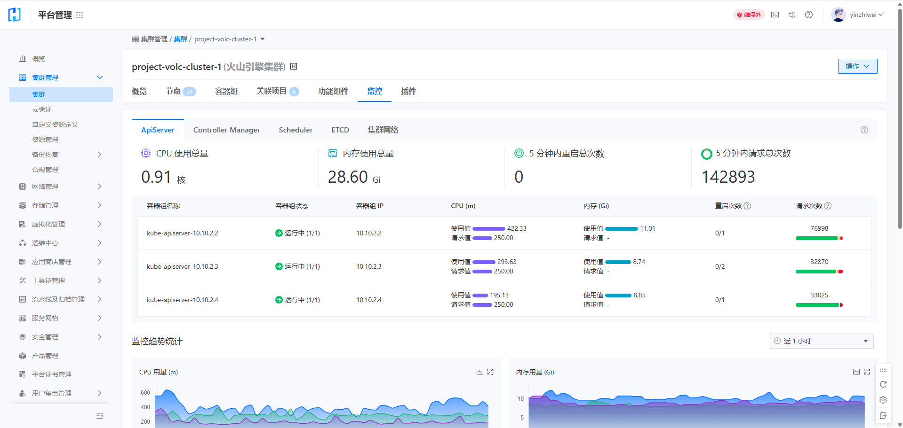
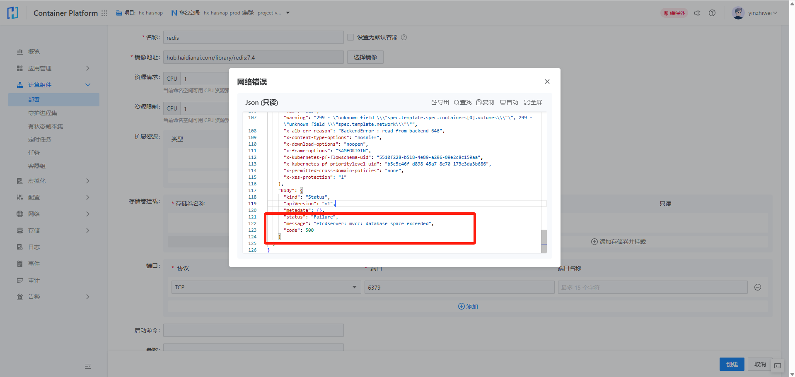

---
kind:
  - Troubleshooting
products:
  - Alauda Container Platform
  - Alauda DevOps
  - Alauda AI
  - Alauda Application Services
  - Alauda Service Mesh
  - Alauda Developer Portal
ProductsVersion:
  - 4.1.0,4.2.x
---
<!-- A type of document that involves encountering a fault, diagnosing it, performing root cause analysis, and providing solutions. -->

# 计算资源无法创建

计算资源无法创建 etcd db size达到2.1G并出现空间不足告警

## Cause
- etcd数据库空间不足（默认2G限制）

## Resolution
- 执行etcd压缩及碎片整理
- 调整etcd db上限至4G
- 修改coredns deployment资源限制
- 调整operator csv资源配置

## [workaround]

## [Related Information]
**Screenshots**

- Environment: 3.18.1
- etcd
- core-dns
- operator
- deployment
- csv
- Component: Docker
- Page ID: 324174119
- Original Title: 容器平台-原生组件-Kubernetes，Docker等原生组件问题-计算资源无法创建-113830
