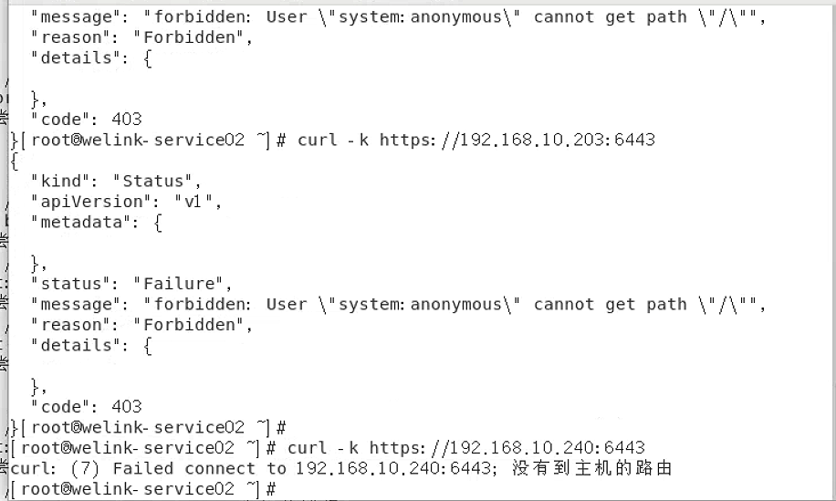

---
kind:
  - Troubleshooting
products:
  - Alauda Container Platform
  - Alauda DevOps
  - Alauda AI
  - Alauda Application Services
  - Alauda Service Mesh
  - Alauda Developer Portal
ProductsVersion:
  - 4.1.0,4.2.x
---
<!-- A type of document that involves encountering a fault, diagnosing it, performing root cause analysis, and providing solutions. -->

# 节点notready

节点notready 计算节点无法连通集群vip alive容器日志存在Unauthorized报错

## Cause
- 自建vip证书过期

## Resolution
- mv /etc/kubernetes/alive/admin.conf /etc/kubernetes/alive-admin-bak.conf
- cp /etc/kubernetes/admin.conf /etc/kubernetes/alive/admin.conf
- sed -i 's#vip#node ip#g' /etc/kubernetes/alive/admin.conf
- docker ps -a|grep alive|awk '{print $1}'|xargs docker rm -f
- 检查alive容器check.log日志无授权报错
- 确认业务节点恢复正常

## [workaround]

## [Related Information]
**Screenshots**
所有计算节点无法连通集群vip（3个master正常），需要检查vip到所有计算节点的网络转发情况
- alive容器
- /etc/kubernetes/alive/admin.conf
- vip配置
- node ip配置
- check.log
- Component: Docker
- Page ID: 327285251
- Original Title: 基础架构-节点notready-113884
