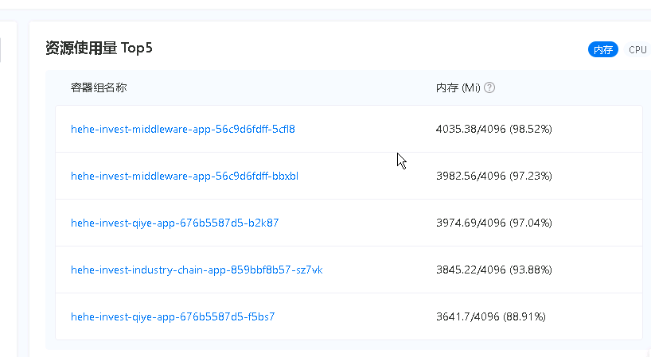
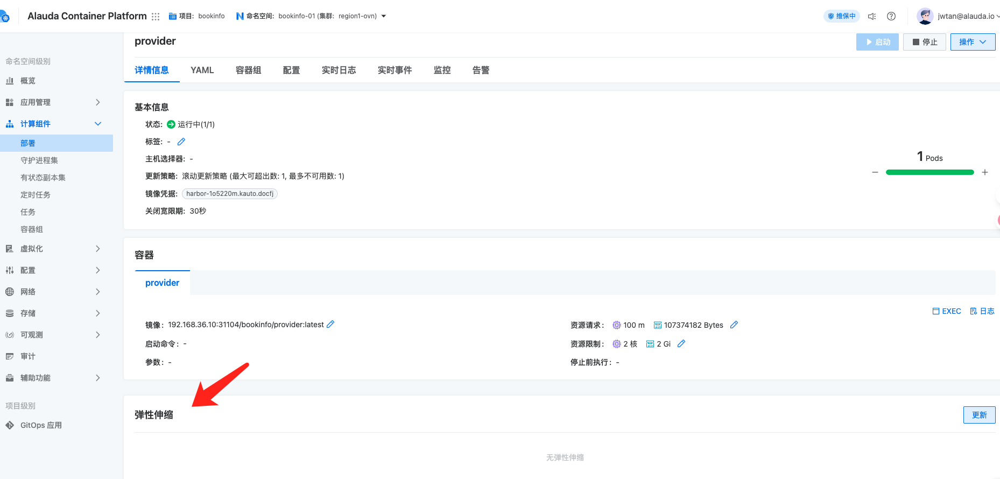
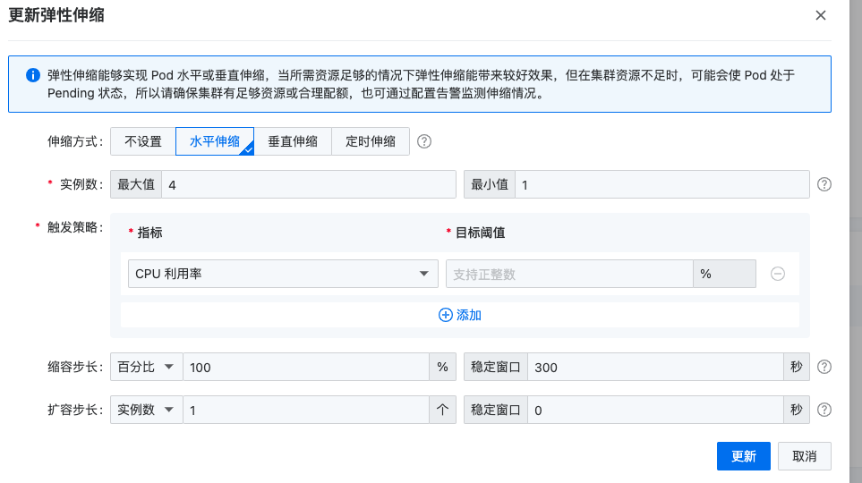

---kind:   - Troubleshootingproducts:    - Alauda Container Platform   - Alauda DevOps   - Alauda AI   - Alauda Application Services   - Alauda Service Mesh   - Alauda Developer PortalProductsVersion:   - 4.1.0,4.2.x---<!-- A type of document that involves encountering a fault, diag...it, performing root cause analysis, and providing solutions. --># 容器组Pod的使用率会过高，调整成自动化扩容pod的cpu或内存使用率过高## Cause## Resolution- 在容器平台弹性伸缩界面配置自动扩容策略- 设置CPU/内存使用率阈值触发扩容- 调整HPA(minReplicas/maxReplicas/targetCPUUtilizationPercentage等参数)## [workaround]## [Related Information]**Screenshots**- Environment: 容器平台 4.0.2- HPA- CPU资源指标- 内存资源指标- metrics-server- Component: Docker- Page ID: 330465754- Original Title: 容器平台-原生组件-Kubernetes，Docker等原生组件问题-容器组Pod的使用率会过高，调整成自动化扩容-114835