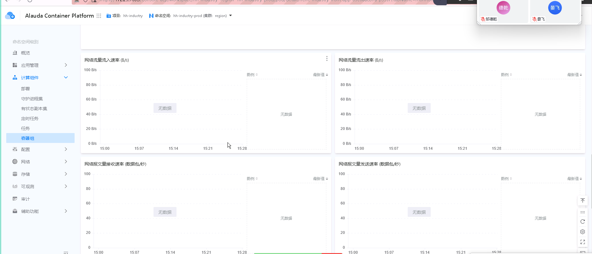

---kind:   - Troubleshootingproducts:    - Alauda Container Platform   - Alauda DevOps   - Alauda AI   - Alauda Application Services   - Alauda Service Mesh   - Alauda Developer PortalProductsVersion:   - 4.1.0,4.2.x---<!-- A type of document that involves encountering a fault, diag...it, performing root cause analysis, and providing solutions. --># 容器组容器组网络流量流入速率没有数据显示 容器组监控页面存在网络相关监控面板## Cause- 当前版本存在无法监控单个容器网络数据的bug- 网络监控数据最小粒度为Pod级别## Resolution- 升级到4.0.4或更高版本## [workaround]## [Related Information]**Screenshots**- Environment: 4.0.2- 容器组- Pod- 网络监控面板- 4.0.2- 4.0.4- Component: Docker- Page ID: 330465773- Original Title: 容器平台-容器组-网络流量流入速率没有数据显示-114592