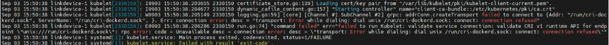

---kind:   - Troubleshootingproducts:    - Alauda Container Platform   - Alauda DevOps   - Alauda AI   - Alauda Application Services   - Alauda Service Mesh   - Alauda Developer PortalProductsVersion:   - 4.1.0,4.2.x---<!-- A type of document that involves encountering a fault, diag...it, performing root cause analysis, and providing solutions. --># 物理机掉电重启后，虚机节点无法加入到k8s集群，节点状态NotReady。部分容器无法启动。虚机节点无法加入到k8s集群 节点状态NotReady 部分容器无法启动## Cause- cri-docker服务异常导致kubelet无法连接容器运行时接口## Resolution- systemctl restart cri-docker- systemctl restart docker- systemctl restart kubelet## [workaround]## [Related Information]**Screenshots**- Environment: 3.16.1-hicampus- kubelet- cri-docker- docker- systemctl- Component: Docker- Page ID: 341705034- Original Title: 容器平台-原生组件-Kubernetes，Docker等原生组件问题-物理机掉电重启后，虚机节点无法加入到k8s集群，节点状态NotReady。部分容器无法启动。-116770