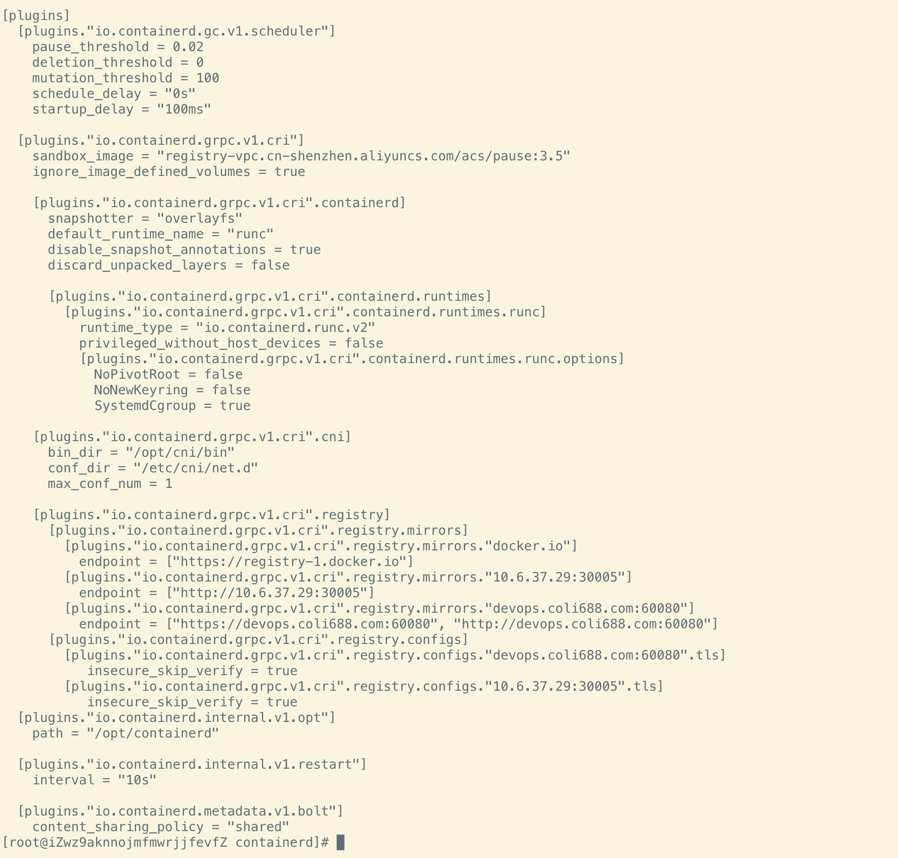

---
kind:
  - Troubleshooting
products:
  - Alauda Container Platform
  - Alauda DevOps
  - Alauda AI
  - Alauda Application Services
  - Alauda Service Mesh
  - Alauda Developer Portal
ProductsVersion:
  - 4.1.0,4.2.x
---
<!-- A type of document that involves encountering a fault, diagnosing it, performing root cause analysis, and providing solutions. -->

# containerd拉取镜像问题

使用ctr命令拉取镜像失败

## Cause
- ctr命令未调用/etc/containerd/config.toml配置

## Resolution
- 改用crictl命令拉取镜像

## [workaround]

## [Related Information]
**Screenshots**

- Environment: TKE 3.6以上
- ctr
- crictl
- /etc/containerd/config.toml
- Component: containerd
- Page ID: 120117627
- Original Title: containerd拉取镜像问题
