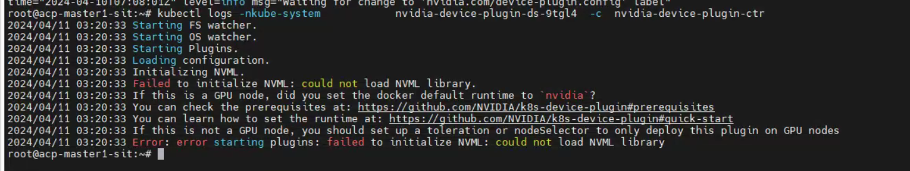
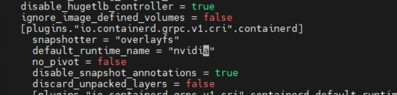

---
kind:
  - Troubleshooting
products:
  - Alauda Container Platform
  - Alauda DevOps
  - Alauda AI
  - Alauda Application Services
  - Alauda Service Mesh
  - Alauda Developer Portal
ProductsVersion:
  - 4.1.0,4.2.x
---
<!-- A type of document that involves encountering a fault, diagnosing it, performing root cause analysis, and providing solutions. -->

# nvidia plugin pod报错could not load NVML library

nvidia plugin pod报错could not load NVML library

## Cause
- containerd的default_runtime_name未配置为nvidia

## Resolution
- 修改containerd配置的default_runtime_name为nvidia，并重启containerd服务

## [workaround]

## [Related Information]
**Screenshots**

- Environment: 3.12.1
- containerd配置
- nvidia-device-plugin-ds-*
- default_runtime_name
- Component: containerd
- Page ID: 201462973
- Original Title: 容器平台-nvidia plugin pod报错could not load NVML library
