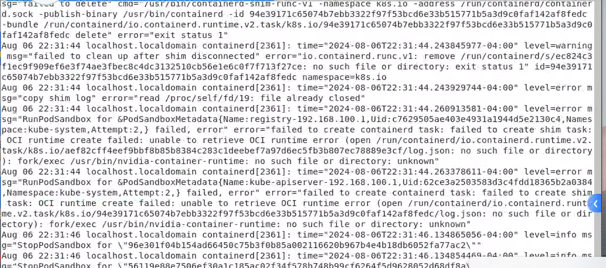

---
kind:
  - Troubleshooting
products:
  - Alauda Container Platform
  - Alauda DevOps
  - Alauda AI
  - Alauda Application Services
  - Alauda Service Mesh
  - Alauda Developer Portal
ProductsVersion:
  - 4.1.0,4.2.x
---
<!-- A type of document that involves encountering a fault, diagnosing it, performing root cause analysis, and providing solutions. -->

# v3.16

pod无法正常运行 containerd日志报错: fork/exec /usr/bin/nvidia-container-runtime: no such file or directory: unknown

## Cause
- 卸载NVIDIA驱动后仍使用nvidia运行时配置
- containerd配置中default_runtime_name仍为nvidia

## Resolution
- 修改/etc/containerd/config.toml文件中的default_runtime_name = "runc"
- 重启containerd服务

## [workaround]

## [Related Information]
**Screenshots**

- Environment: 3.16.1
- /usr/bin/nvidia-container-runtime
- /etc/containerd/config.toml
- AppRelease
- pgpu
- Component: containerd
- Page ID: 233866453
- Original Title: v3.16-数据服务-AI-卸载GPU驱动后pod无法正常运行
