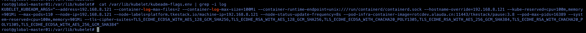

---
kind:
  - Troubleshooting
products:
  - Alauda Container Platform
  - Alauda DevOps
  - Alauda AI
  - Alauda Application Services
  - Alauda Service Mesh
  - Alauda Developer Portal
ProductsVersion:
  - 4.1.0,4.2.x
---
<!-- A type of document that involves encountering a fault, diagnosing it, performing root cause analysis, and providing solutions. -->

# 使用containerd部署的平台对标准输出日志是否有限制

容器长时间运行且大量打印标准输出可能导致磁盘被写爆

## Cause
- 未持久化的标准输出日志会持续存储在本地，容器重启前不会自动清理

## Resolution
- 1. 配置日志存储插件的日志保留策略
2. 检查kubelet的containerLogMaxSize和containerLogMaxFiles参数设置
3. 建议开启日志持久化到ES

## [workaround]
- 定期重启容器或手动清理节点日志文件

## [Related Information]
**Screenshots**

- Environment: 4.0.0版本容器平台
- kubelet
- containerLogMaxSize
- containerLogMaxFiles
- Elasticsearch日志插件
- Component: containerd
- Page ID: 324173962
- Original Title: 基础架构-使用containerd部署的平台对标准输出日志是否有限制-113887
