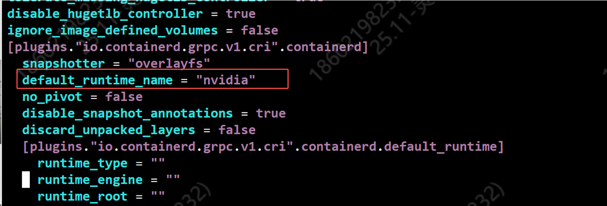
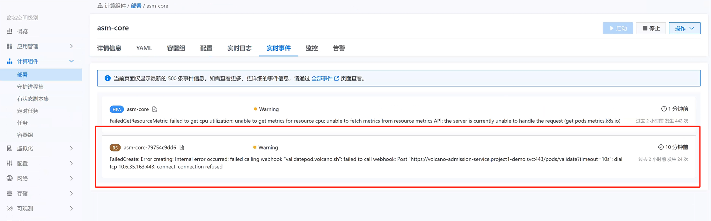
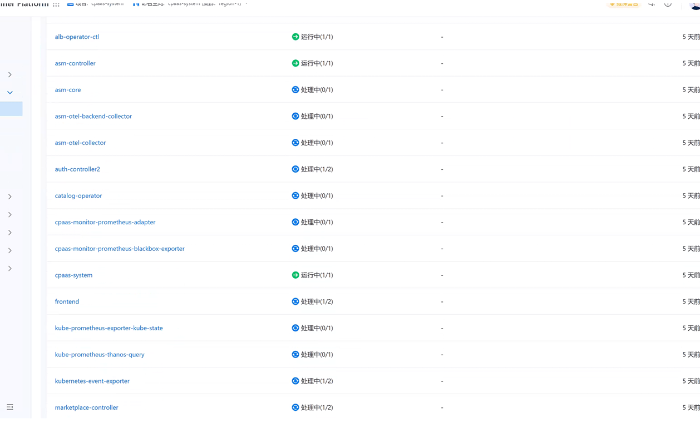
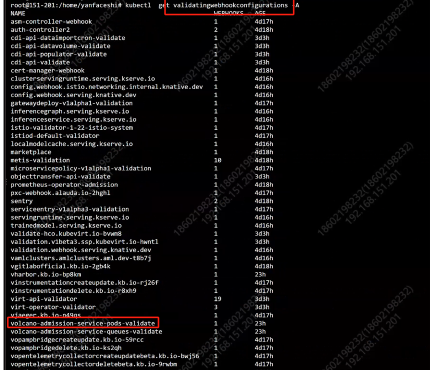

---
kind:
  - Troubleshooting
products:
  - Alauda Container Platform
  - Alauda DevOps
  - Alauda AI
  - Alauda Application Services
  - Alauda Service Mesh
  - Alauda Developer Portal
ProductsVersion:
  - 4.1.0,4.2.x
---
<!-- A type of document that involves encountering a fault, diagnosing it, performing root cause analysis, and providing solutions. -->

# 安装hami集群插件失败

安装hami集群插件失败，一直转圈 相关pod未创建

## Cause
- containerd默认runtime配置为runc
- volcano-admission-service-pods-validate的validatingwebhookconfigurations拦截了pod创建

## Resolution
- 修改/etc/containerd/config.toml中的default_runtime_name为"nvidia"
- 删除volcano-admission-service-pods-validate的validatingwebhookconfigurations资源

## [workaround]

## [Related Information]
**Screenshots**

- Environment: 4.0.2
- /etc/containerd/config.toml
- default_runtime_name
- validatingwebhookconfigurations
- volcano-admission-service-pods-validate
- Component: containerd
- Page ID: 330465885
- Original Title: 微服务-AI-安装hami集群插件失败-112366
