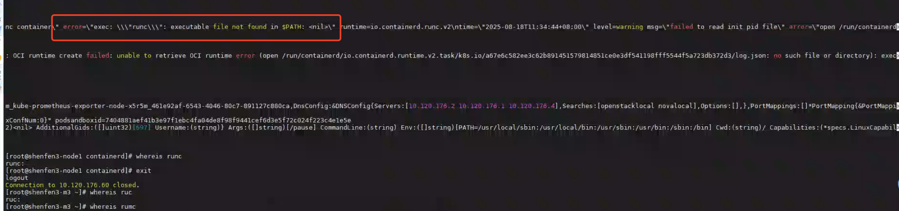

---kind:   - Troubleshootingproducts:    - Alauda Container Platform   - Alauda DevOps   - Alauda AI   - Alauda Application Services   - Alauda Service Mesh   - Alauda Developer PortalProductsVersion:   - 4.1.0,4.2.x---<!-- A type of document that involves encountering a fault, diag...it, performing root cause analysis, and providing solutions. --># 业务重启containerd，containerd起不来，pod也起不来kubelet连接containerd异常 containerd加载配置失败 节点找不到runc命令## Cause- 节点缺少runc二进制文件## Resolution- 从正常节点复制runc到/usr/bin/runc- chmod +x /usr/bin/runc- systemctl restart containerd- systemctl restart kubelet## [workaround]## [Related Information]**Screenshots**- Environment: 3.16.2- containerd- kubelet- runc- Component: containerd- Page ID: 333316772- Original Title: 容器平台-原生组件-Kubernetes，Docker等原生组件问题-业务重启containerd，containerd起不来，pod也起不来-115405