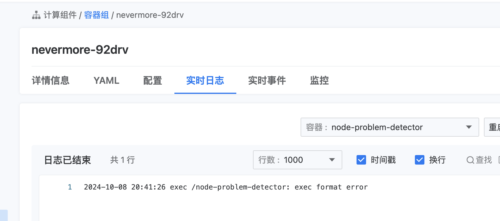

---
kind:
  - Troubleshooting
products:
  - Alauda Container Platform
  - Alauda DevOps
  - Alauda AI
  - Alauda Application Services
  - Alauda Service Mesh
  - Alauda Developer Portal
ProductsVersion:
  - 4.1.0,4.2.x
---
<!-- A type of document that involves encountering a fault, diagnosing it, performing root cause analysis, and providing solutions. -->

# 节点无法正常部署某些 Pod

Pod 无法在当前节点启动（其他节点正常） 容器日志报错（具体内容未展示） 导出容器镜像时出现镜像层缺失报错：ctr: failed to get reader: content digest sha256:... not found

## Cause
- containerd 元数据损坏导致的镜像层缺失
- containerd 已知 bug（未提及具体编号）

## Resolution
- systemctl disable containerd
- systemctl stop containerd
- rm -rf /var/lib/containerd /var/log/pods
- reboot

## [workaround]

## [Related Information]
**Screenshots**

- Environment: containerd 容器引擎（所有版本）
- containerd
- crictl inspecti
- ctr image export
- /var/lib/containerd
- /var/log/pods
- Component: containerd
- Page ID: 335938438
- Original Title: 节点无法正常部署某些 Pod
