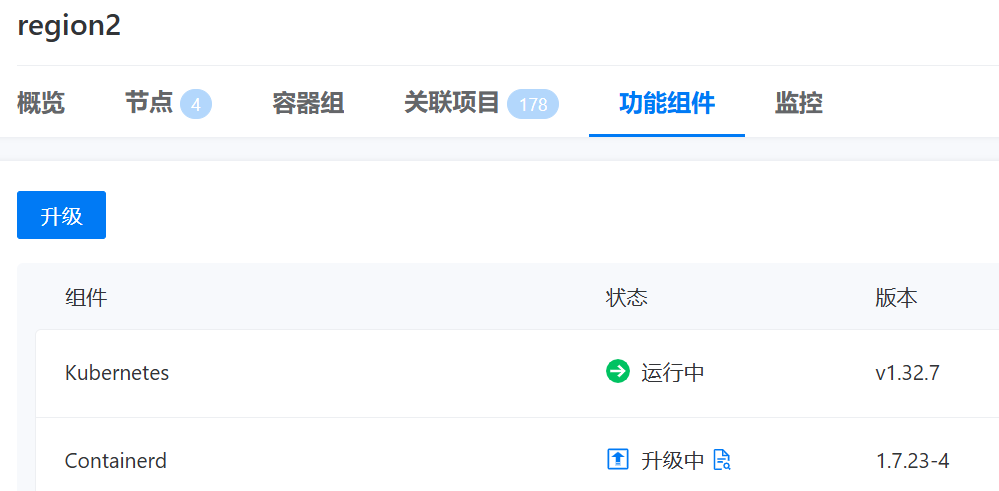

---
kind:
  - Troubleshooting
products:
  - Alauda Container Platform
  - Alauda DevOps
  - Alauda AI
  - Alauda Application Services
  - Alauda Service Mesh
  - Alauda Developer Portal
ProductsVersion:
  - 4.1.0,4.2.x
---
<!-- A type of document that involves encountering a fault, diagnosing it, performing root cause analysis, and providing solutions. -->

# demo客户试用环境业务集群升级containerd卡住

containerd升级卡住

## Cause
- 存在旧版本的cri Pod

## Resolution
- 删除历史遗留的cri Pod

## [workaround]

## [Related Information]
**Screenshots**
demo客户试用环境业务集群升级containerd卡住
- Environment: 4.0.3
- cri Pod
- Component: containerd
- Page ID: 336396988
- Original Title: 基础架构-产品生命周期管理-升级-demo客户试用环境业务集群升级containerd卡住-115411
