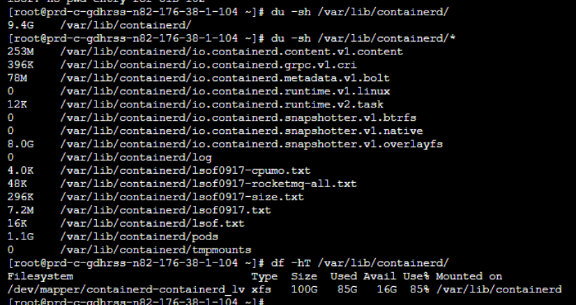
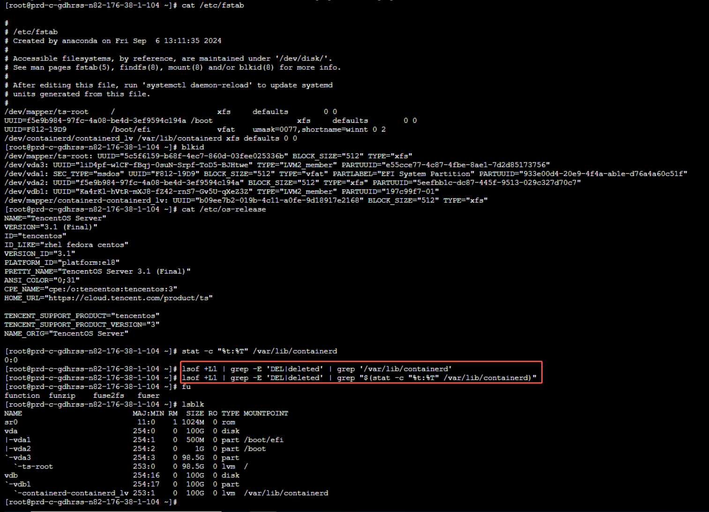
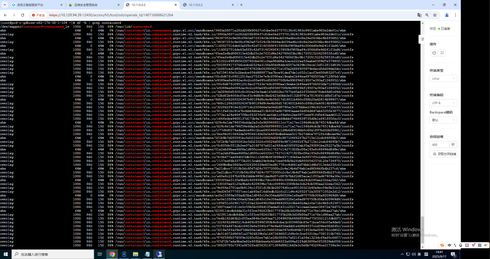
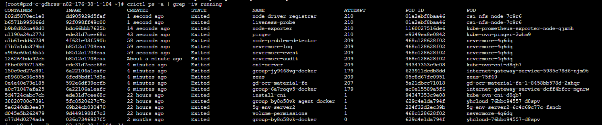
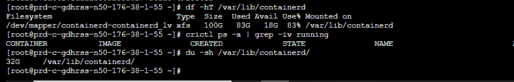
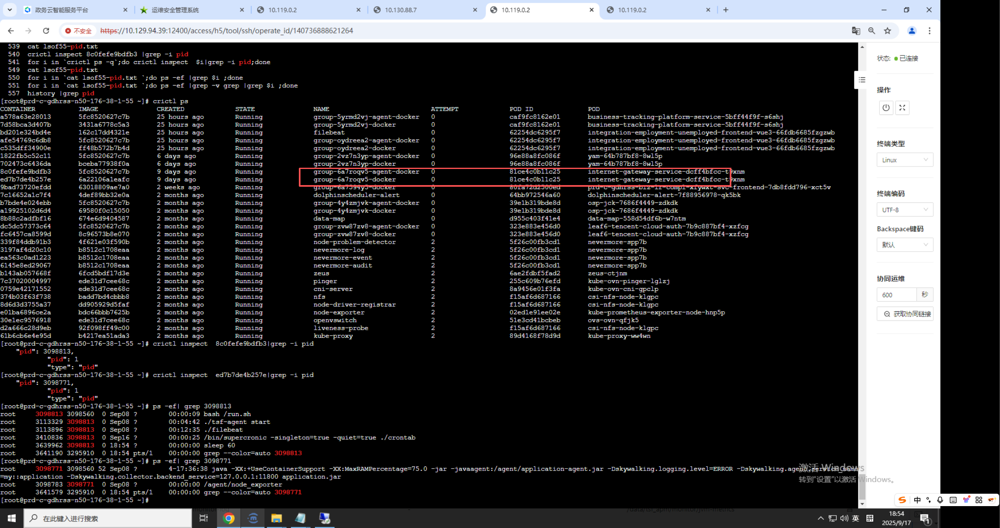

---
kind:
  - Troubleshooting
products:
  - Alauda Container Platform
  - Alauda DevOps
  - Alauda AI
  - Alauda Application Services
  - Alauda Service Mesh
  - Alauda Developer Portal
ProductsVersion:
  - 4.1.0,4.2.x
---
<!-- A type of document that involves encountering a fault, diagnosing it, performing root cause analysis, and providing solutions. -->

# containerd目录磁盘空间占满，但目录下未找到被删除文件占用空间

containerd目录磁盘空间占满但未找到被删除文件 已退出的容器占用空间 业务Pod存在大量文件生成/删除动作

## Cause
- 已退出的容器未清理占用存储空间
- 业务Pod挂载主机目录导致大量文件操作

## Resolution
- 清理已退出的容器: crictl ps -a |grep -iv running
- 优化业务Pod文件操作逻辑

## [workaround]
- 定期执行容器清理: crictl rm <容器ID>

## [Related Information]
**Screenshots**

- Environment: 3.14.2
- crictl ps -a |grep -iv running
- containerd目录
- 业务Pod主机目录挂载配置
- Component: containerd
- Page ID: 347439308
- Original Title: 容器平台-containerd目录磁盘空间占满，但目录下未找到被删除文件占用空间-117895
