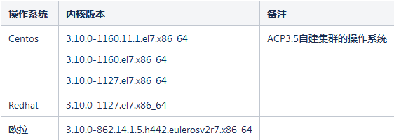

---
kind:
  - Troubleshooting
products:
  - Alauda Container Platform
  - Alauda DevOps
  - Alauda AI
  - Alauda Application Services
  - Alauda Service Mesh
  - Alauda Developer Portal
ProductsVersion:
  - 4.1.0,4.2.x
---
<!-- A type of document that involves encountering a fault, diagnosing it, performing root cause analysis, and providing solutions. -->

# 3.6.1

falco pod无法正常运行，一直crash 查看日志报错无法下载对应的内核模块

## Cause
- 部署安全组件falco时内核版本不满足要求，无法构建驱动

## Resolution
- 检查操作系统及内核版本是否符合支持列表要求
- 升级操作系统或内核到支持的版本

## [workaround]

## [Related Information]
**Screenshots**

- Environment: 3.6.1
- falco
- 内核模块
- 驱动构建
- Component: 安全组件
- Page ID: 115526648
- Original Title: 3.6.1-容器平台-部署安全组件pod无法正常运行
