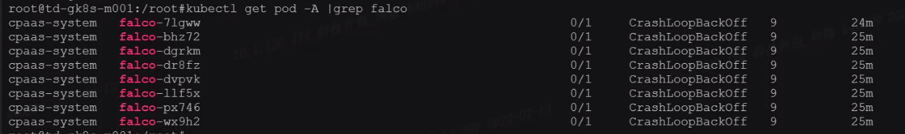

---
kind:
  - Troubleshooting
products:
  - Alauda Container Platform
  - Alauda DevOps
  - Alauda AI
  - Alauda Application Services
  - Alauda Service Mesh
  - Alauda Developer Portal
ProductsVersion:
  - 4.1.0,4.2.x
---
<!-- A type of document that involves encountering a fault, diagnosing it, performing root cause analysis, and providing solutions. -->

# 集群插件

falco安全组件部署失败 服务启动报错日志内容

## Cause
- 当前集群节点内核版本不支持

## Resolution
- 升级操作系统内核至支持版本或更换至支持的操作系统

## [workaround]

## [Related Information]
**Screenshots**

- Environment: 3.8.1
- Component: 安全组件
- Page ID: 120105456
- Original Title: 集群插件-falco安全组件部署失败
