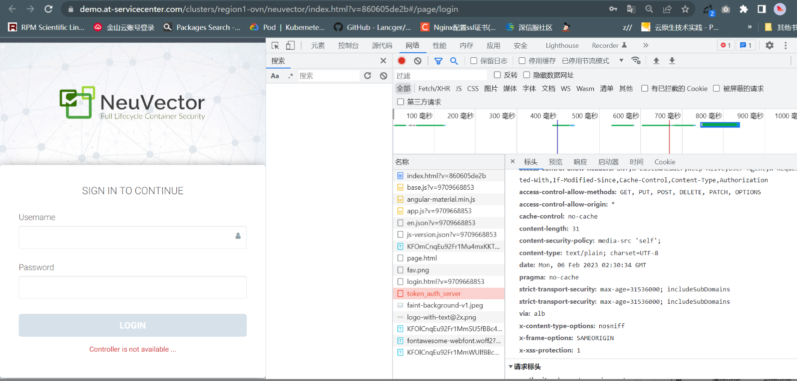
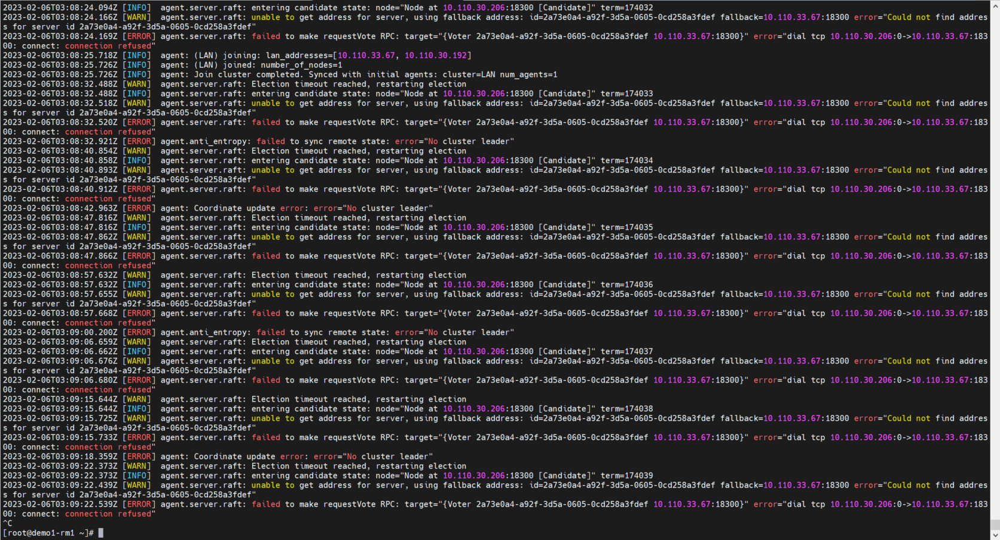
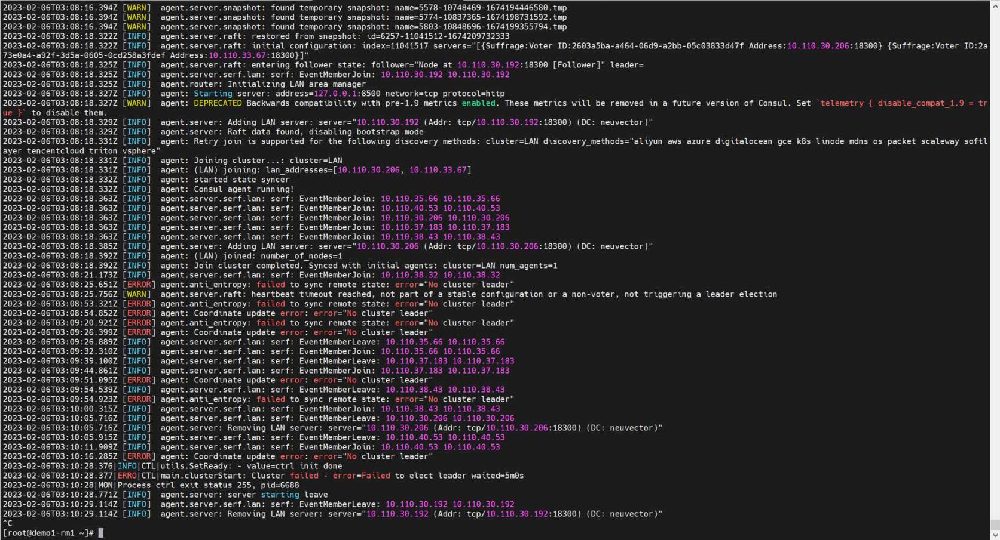
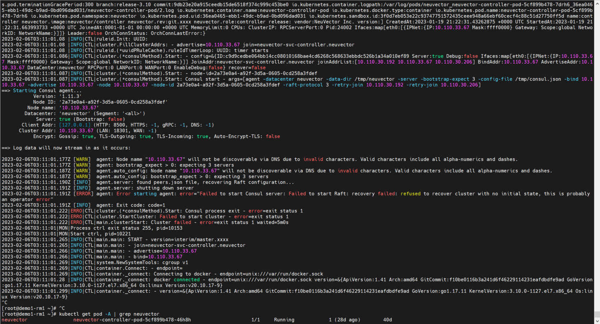
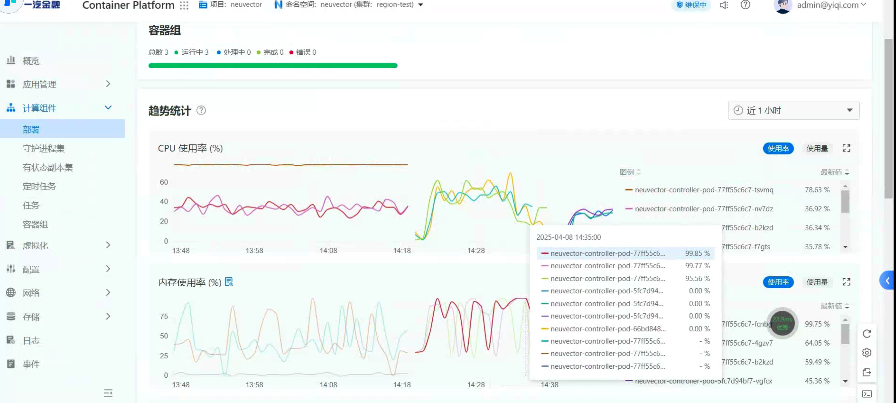
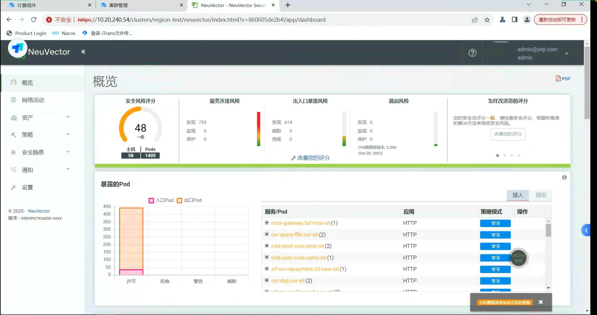

---
kind:
  - Troubleshooting
products:
  - Alauda Container Platform
  - Alauda DevOps
  - Alauda AI
  - Alauda Application Services
  - Alauda Service Mesh
  - Alauda Developer Portal
ProductsVersion:
  - 4.1.0,4.2.x
---
<!-- A type of document that involves encountering a fault, diagnosing it, performing root cause analysis, and providing solutions. -->

# 3.10.2

neuvector容器安全平台访问失败，提示网络错误 neuvector-controller组件日志显示资源不足

## Cause
- neuvector-controller资源不足导致服务不可用

## Resolution
- 扩容neuvector-controller资源并重启组件

## [workaround]

## [Related Information]
**Screenshots**

- neuvector-controller
- resources.requests
- resources.limits
- Component: neuvector
- Page ID: 136537509
- Original Title: 3.10.2-容器安全-neuvector容器安全平台访访问登录失败
