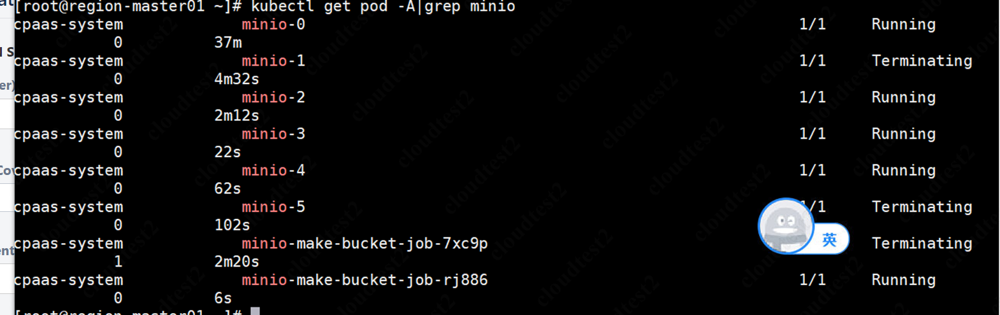
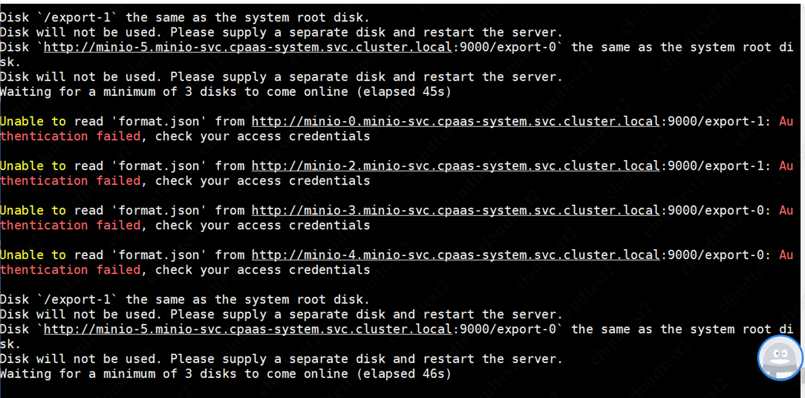

---
kind:
  - Troubleshooting
products:
  - Alauda Container Platform
  - Alauda DevOps
  - Alauda AI
  - Alauda Application Services
  - Alauda Service Mesh
  - Alauda Developer Portal
ProductsVersion:
  - 4.1.0,4.2.x
---
<!-- A type of document that involves encountering a fault, diagnosing it, performing root cause analysis, and providing solutions. -->

# 3.8

部署minio插件失败 minio的pod一直处于Terminating状态

## Cause
- 历史部署残留资源未清理
- 磁盘路径'/export-1'与系统根目录相同

## Resolution
- 前端卸载minio插件
- 清理minio对应的job和sts资源
- 确认资源清理完成后重新部署

## [workaround]

## [Related Information]
**Screenshots**

- Environment: 3.8
- minio组件
- job
- sts
- /export-1
- Component: S3/MinIO
- Page ID: 115525731
- Original Title: 3.8-部署minio插件失败
