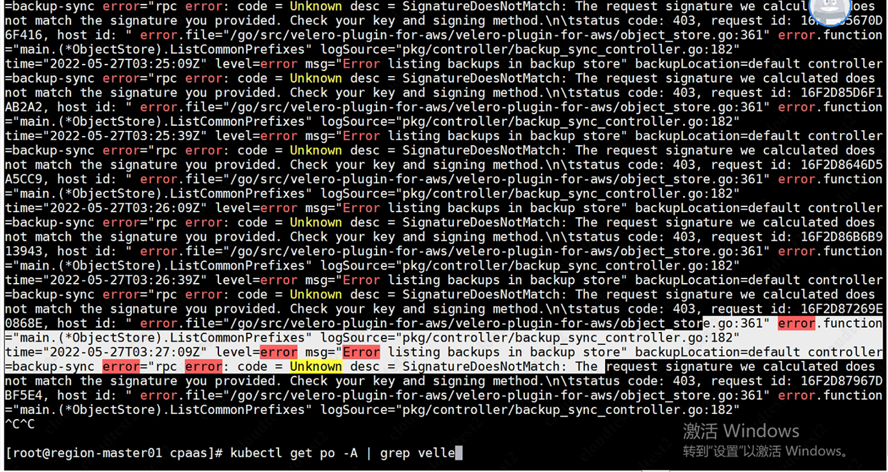
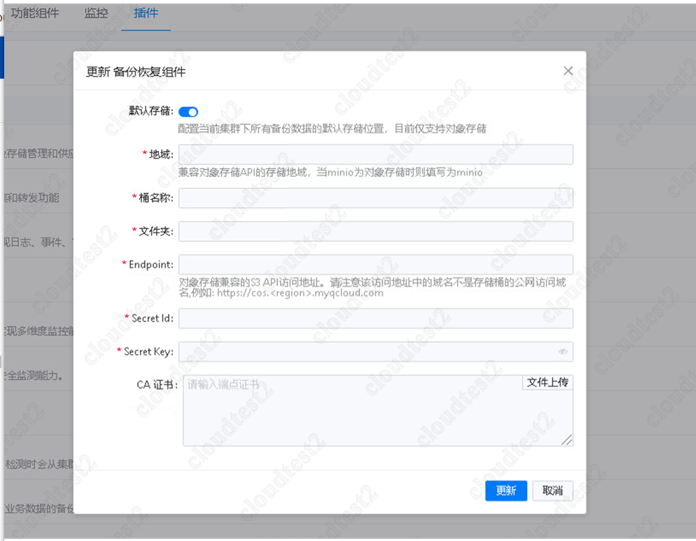
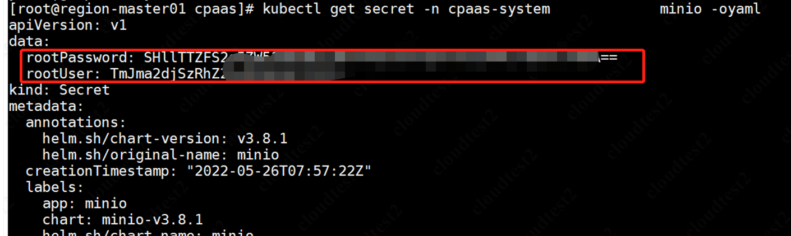
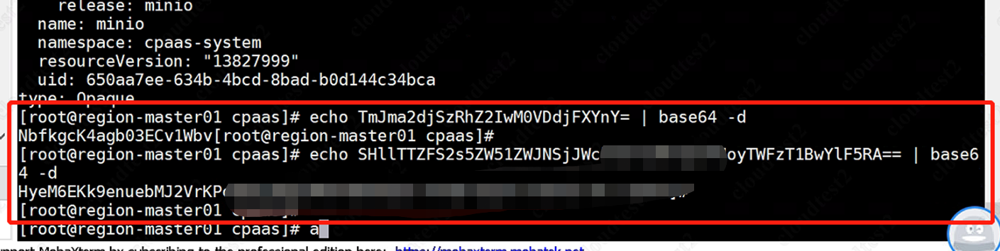

---
kind:
  - Troubleshooting
products:
  - Alauda Container Platform
  - Alauda DevOps
  - Alauda AI
  - Alauda Application Services
  - Alauda Service Mesh
  - Alauda Developer Portal
ProductsVersion:
  - 4.1.0,4.2.x
---
<!-- A type of document that involves encountering a fault, diagnosing it, performing root cause analysis, and providing solutions. -->

# 3.8

应用备份失败 velero日志报错SignatureDoesNotMatch: The request signature we calculated does not match the signature you provided

## Cause
- 备份恢复组件信息配置错误

## Resolution
- 将Endpoint更正为minio的svc地址，格式为http://svc:ip:9000
- Secret Id和Secret Key使用minio secret中base64解码后的rootUser和rootPassword

## [workaround]

## [Related Information]
**Screenshots**

- Environment: 3.8
- minio
- velero
- 备份恢复组件
- Endpoint
- Secret Id
- Secret Key
- Component: S3/MinIO
- Page ID: 115525737
- Original Title: 3.8-应用备份失败
