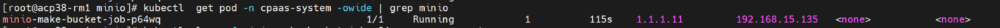
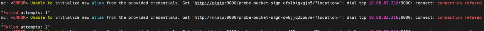
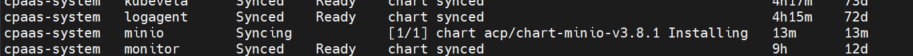
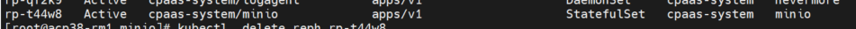

---
kind:
  - Troubleshooting
products:
  - Alauda Container Platform
  - Alauda DevOps
  - Alauda AI
  - Alauda Application Services
  - Alauda Service Mesh
  - Alauda Developer Portal
ProductsVersion:
  - 4.1.0,4.2.x
---
<!-- A type of document that involves encountering a fault, diagnosing it, performing root cause analysis, and providing solutions. -->

# 3.8.1

只有 minio-make-bucket-job 处于 Running 状态，StatefulSet(sts) 和 Pod 未创建 apprelease 状态为 Syncing [1/1]，持续处于 Installing 状态 minio-make-bucket-job 日志显示连接 minio:9000 被拒绝: dial tcp 10.88.83.216:9000: connect: connection refused

## Cause
- 卸载时删除 StatefulSet 残留了 resourcepatch 资源，阻塞了 minio 的新建流程

## Resolution
- 执行 kubectl get rpch 确认残留的 resourcepatch
- 删除 minio 相关的 resourcepatch: kubectl delete rpch <resourcepatch_name> -n cpaas-system

## [workaround]

## [Related Information]
**Screenshots**

- Environment: ACP 3.8.1
- rpch
- StatefulSet
- minio-make-bucket-job
- apprelease
- minio:9000
- Component: S3/MinIO
- Page ID: 119085976
- Original Title: 3.8.1-部署minio插件失败-只创建了job
