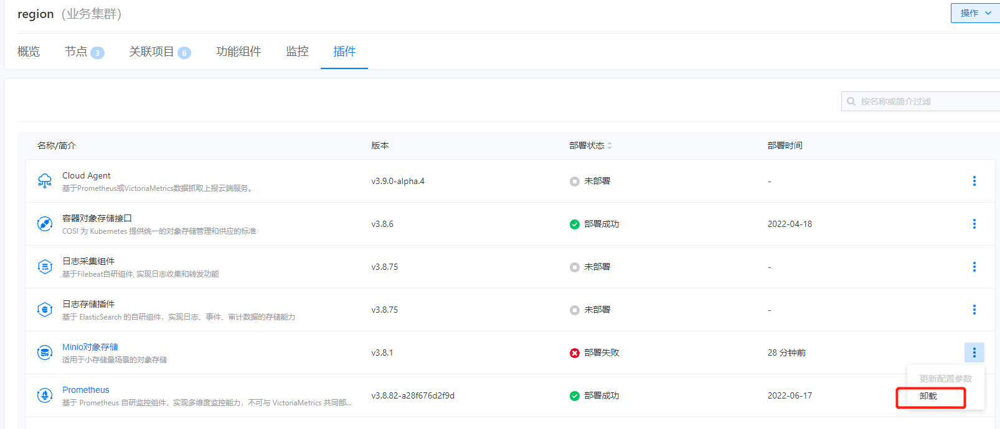

---
kind:
  - Troubleshooting
products:
  - Alauda Container Platform
  - Alauda DevOps
  - Alauda AI
  - Alauda Application Services
  - Alauda Service Mesh
  - Alauda Developer Portal
ProductsVersion:
  - 4.1.0,4.2.x
---
<!-- A type of document that involves encountering a fault, diagnosing it, performing root cause analysis, and providing solutions. -->

# 3.8.1

JIRA Jira：

## Cause

## Resolution
- 前端UI界面点击卸载minio插件
- kubectl delete job minio-make-bucket-job -n cpaas-system
- kubectl delete sts -n cpaas-system minio
- kubectl delete rpch rp-lgbww
- rm -rf /minio/*

## [workaround]

## [Related Information]
**Screenshots**

- minio-make-bucket-job
- minio
- rp-lgbww
- /minio/*
- cpaas-system
- job
- sts
- rpch
- Component: S3/MinIO
- Page ID: 119086009
- Original Title: 3.8.1-如何卸载minio插件
