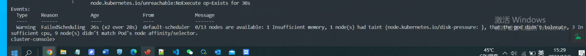
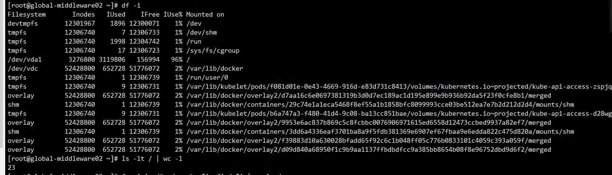

---
kind:
  - Troubleshooting
products:
  - Alauda Container Platform
  - Alauda DevOps
  - Alauda AI
  - Alauda Application Services
  - Alauda Service Mesh
  - Alauda Developer Portal
ProductsVersion:
  - 4.1.0,4.2.x
---
<!-- A type of document that involves encountering a fault, diagnosing it, performing root cause analysis, and providing solutions. -->

# 3.10.1

topolvm-node pod处于pending状态 节点存在磁盘压力污点 /盘inode使用超过95%

## Cause
- /盘inode使用率超过95%触发磁盘压力标签
- 测试部署的minio插件导致/data目录inode异常

## Resolution
- 执行命令检查inode使用情况: for i in /*; do echo $i; find $i | wc -l; done
- 卸载minio插件
- 清理/data目录异常文件

## [workaround]

## [Related Information]
**Screenshots**

- Environment: 3.10.1
- /data
- minio插件
- topolvm-node
- Component: S3/MinIO
- Page ID: 133091918
- Original Title: 3.10.1-容器平台-topolvm存储节点异常
