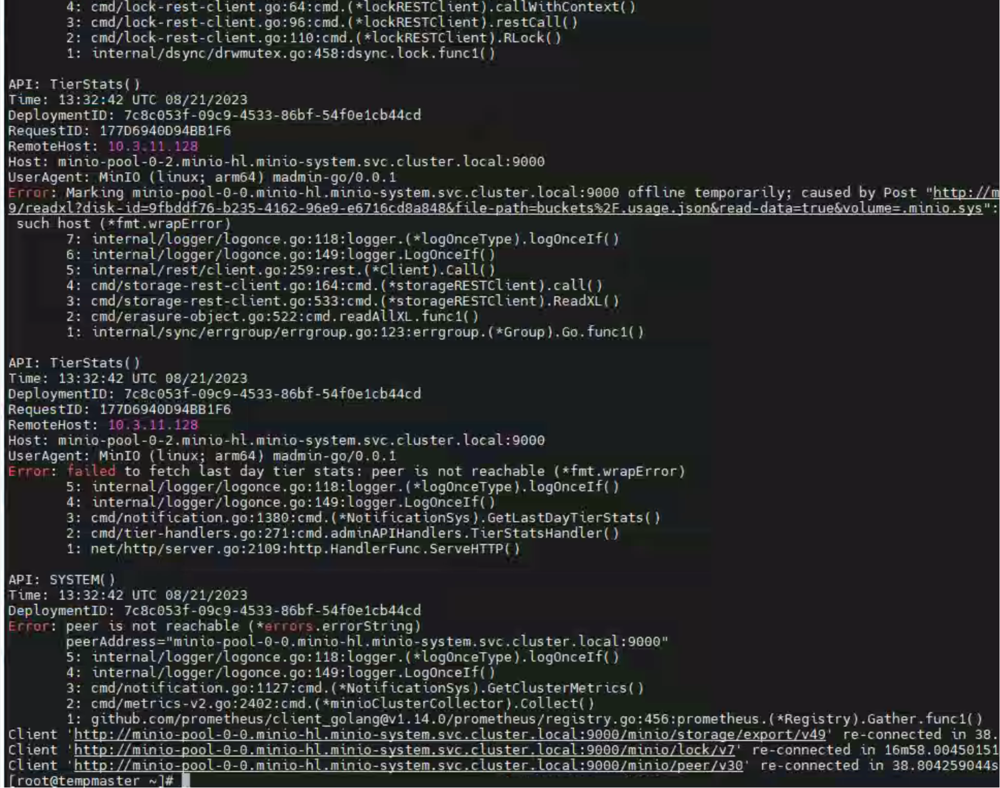

---
kind:
  - Troubleshooting
products:
  - Alauda Container Platform
  - Alauda DevOps
  - Alauda AI
  - Alauda Application Services
  - Alauda Service Mesh
  - Alauda Developer Portal
ProductsVersion:
  - 4.1.0,4.2.x
---
<!-- A type of document that involves encountering a fault, diagnosing it, performing root cause analysis, and providing solutions. -->

# 3.12.1

通过minio UI界面下载资源失败 minio-console日志存在报错 匿名下载未成功

## Cause
- 目标bucket未配置匿名下载权限
- minio-console存在已知下载功能缺陷

## Resolution
- 执行存储桶匿名下载授权命令：mc anonymous set download buckup/xxxx

## [workaround]

## [Related Information]
**Screenshots**

- Environment: 3.12.1
- minio-console
- mc命令行工具
- bucket匿名策略
- minio server
- Component: S3/MinIO
- Page ID: 161385094
- Original Title: 3.12.1-请求minio无法获取到资源
