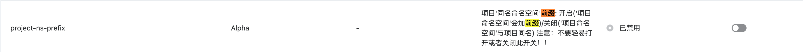

---
kind:
  - Troubleshooting
products:
  - Alauda Container Platform
  - Alauda DevOps
  - Alauda AI
  - Alauda Application Services
  - Alauda Service Mesh
  - Alauda Developer Portal
ProductsVersion:
  - 4.1.0,4.2.x
---
<!-- A type of document that involves encountering a fault, diagnosing it, performing root cause analysis, and providing solutions. -->

# 创建 S3 外接存储失败（报错："namespaces"cpaas

创建 S3 外接存储失败，报错：namespaces"cpaas-prj-xxli\".not.found

## Cause
- 开启 project-ns-prefix 功能开关导致命名空间校验异常

## Resolution
- 关闭 project-ns-prefix 功能开关
- 重启 auth-controller2 Pod 并在新建项目中创建外接 S3（仅对后续新建项目有效）

## [workaround]

## [Related Information]
**Screenshots**

- Environment: Global 集群 cpaas-system 命名空间，开启 project-ns-prefix 功能开关的环境
- auth-controller2
- cpaas-system
- project-ns-prefix
- kubectl delete pod
- Component: S3/MinIO
- Page ID: 257262049
- Original Title: 创建 S3 外接存储失败（报错："namespaces"cpaas-prj-xxli\".not.found"）的解决办法
