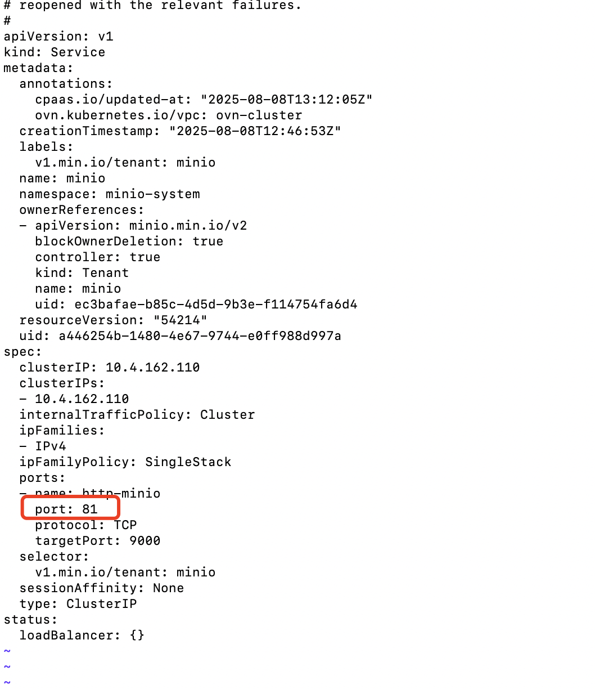
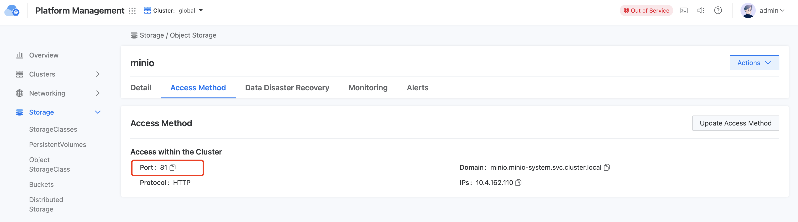
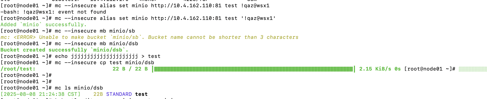

---
kind:
  - Troubleshooting
products:
  - Alauda Container Platform
  - Alauda DevOps
  - Alauda AI
  - Alauda Application Services
  - Alauda Service Mesh
  - Alauda Developer Portal
ProductsVersion:
  - 4.1.0,4.2.x
---
<!-- A type of document that involves encountering a fault, diagnosing it, performing root cause analysis, and providing solutions. -->

# change minio instance port

MinIO instance using port 80 with potential security risk

## Cause
- MinIO service configured with HTTP protocol on port 80

## Resolution
- kubectl edit svc -n minio-system minio and modify port field to 443

## [workaround]

## [Related Information]
**Screenshots**

- Environment: ACP 3.16.2 (TopoLVM-based production environment)
- minio-system/minio Service
- port configuration
- mc command
- Component: S3/MinIO
- Page ID: 330466249
- Original Title: 容器平台-存储-其他（容器对象存储接口/快照控制器）-change minio instance port-1857
