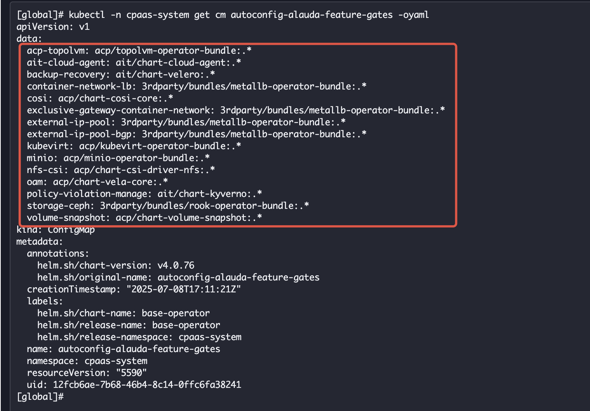
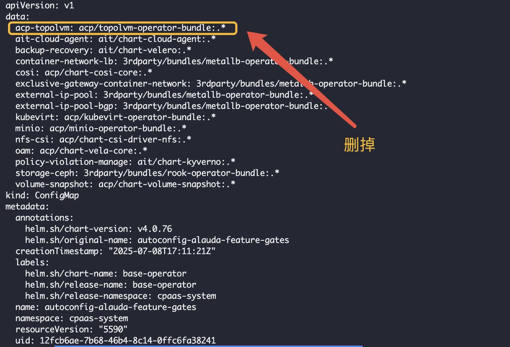

---
kind:
  - Troubleshooting
products:
  - Alauda Container Platform
  - Alauda DevOps
  - Alauda AI
  - Alauda Application Services
  - Alauda Service Mesh
  - Alauda Developer Portal
ProductsVersion:
  - 4.1.0,4.2.x
---
<!-- A type of document that involves encountering a fault, diagnosing it, performing root cause analysis, and providing solutions. -->

# 部分特性无法关闭

无法关闭minio、acp-topolvm、external-ip-pool等功能 关闭后会自动开启

## Cause
- autoconfig-alauda-feature-gates ConfigMap中配置的开关在对应镜像存在时会自动开启

## Resolution
- 备份并编辑cpaas-system命名空间下的autoconfig-alauda-feature-gates ConfigMap
- kubectl -n cpaas-system get cm autoconfig-alauda-feature-gates -oyaml >> feature-gates.yaml
- kubectl -n cpaas-system edit cm autoconfig-alauda-feature-gates
- 删除不使用的插件字段后关闭页面开关
- 升级前删除生成的rpch资源，升级后需重新修改配置

## [workaround]

## [Related Information]
**Screenshots**

- Environment: 4.0.2
- autoconfig-alauda-feature-gates
- cpaas-system
- rpch
- feature-gate配置项
- Component: S3/MinIO
- Page ID: 339443991
- Original Title: 容器平台-部分特性无法关闭-116677
