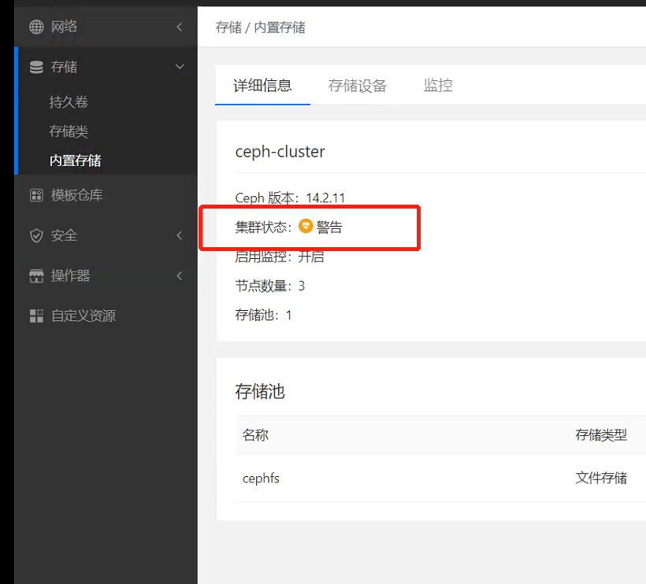
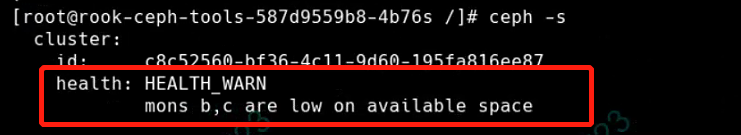
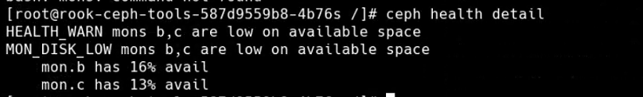

---
kind:
  - Troubleshooting
products:
  - Alauda Container Platform
  - Alauda DevOps
  - Alauda AI
  - Alauda Application Services
  - Alauda Service Mesh
  - Alauda Developer Portal
ProductsVersion:
  - 4.1.0,4.2.x
---
<!-- A type of document that involves encountering a fault, diagnosing it, performing root cause analysis, and providing solutions. -->

# 内置存储的集群状态（警告）

集群状态显示为HEALTH_WARN mons b,c are low on available space /var/lib磁盘空间使用率超过80%

## Cause
- /var/lib/ceph/mon路径所在磁盘可用空间低于30%

## Resolution
- 扩容/var/lib目录所在磁盘空间

## [workaround]

## [Related Information]
**Screenshots**

- Environment: acp 3.x
- rook-ceph-tools
- ceph health detail
- /var/lib/ceph/mon
- ceph监视器
- Component: Ceph
- Page ID: 110133949
- Original Title: 内置存储的集群状态（警告）
