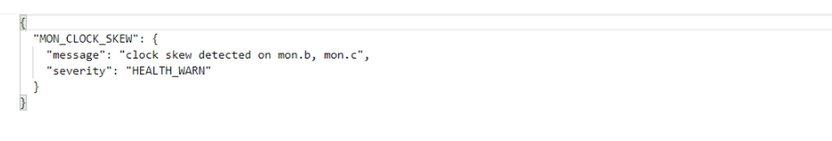

---
kind:
  - Troubleshooting
products:
  - Alauda Container Platform
  - Alauda DevOps
  - Alauda AI
  - Alauda Application Services
  - Alauda Service Mesh
  - Alauda Developer Portal
ProductsVersion:
  - 4.1.0,4.2.x
---
<!-- A type of document that involves encountering a fault, diagnosing it, performing root cause analysis, and providing solutions. -->

# 内置存储

clock skew detected on mon.b, mon.c

## Cause
- mon节点上ntp服务器未启动
- ceph设置的mon时间偏差阈值较小(默认0.05s)

## Resolution
- 对所有节点进行ntp服务部署，指定统一的时间同步服务器

## [workaround]

## [Related Information]
**Screenshots**

- Environment: Ceph通用版本
- ntp
- mon_clock_drift_allowed
- mon.b
- mon.c
- Component: Ceph
- Page ID: 115510081
- Original Title: 内置存储-Ceph告警-clock skew detected on mon.b, mon.c
