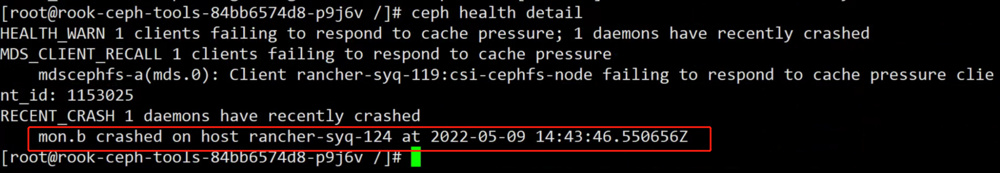

---
kind:
  - Troubleshooting
products:
  - Alauda Container Platform
  - Alauda DevOps
  - Alauda AI
  - Alauda Application Services
  - Alauda Service Mesh
  - Alauda Developer Portal
ProductsVersion:
  - 4.1.0,4.2.x
---
<!-- A type of document that involves encountering a fault, diagnosing it, performing root cause analysis, and providing solutions. -->

# ceph状态告警

ceph界面状态告警 执行ceph -s/ceph health detail报错mon crashed on host

## Cause
- mon容器异常崩溃

## Resolution
- 在rook-ceph-tools容器内执行ceph crash ls
- 使用ceph crash rm <id>删除对应崩溃记录

## [workaround]

## [Related Information]
**Screenshots**

- Environment: 3.x
- rook-ceph-tools容器
- mon组件
- ceph crash命令
- Component: Ceph
- Page ID: 115515755
- Original Title: ceph状态告警
