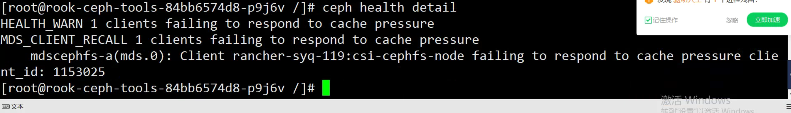

---
kind:
  - Troubleshooting
products:
  - Alauda Container Platform
  - Alauda DevOps
  - Alauda AI
  - Alauda Application Services
  - Alauda Service Mesh
  - Alauda Developer Portal
ProductsVersion:
  - 4.1.0,4.2.x
---
<!-- A type of document that involves encountering a fault, diagnosing it, performing root cause analysis, and providing solutions. -->

# ceph界面状态告警

ceph状态告警 执行ceph -s和ceph health detail报错client failing to respond to cache pressure

## Cause
- 客户端(日志索引等高请求业务)打开过多文件导致rook-ceph-mds缓存压力过高

## Resolution
- 降低客户端请求压力恢复告警
- 可忽略该告警不影响业务

## [workaround]

## [Related Information]
**Screenshots**

- Environment: 3.x
- rook-ceph-mds
- ceph -s
- ceph health detail
- Component: Ceph
- Page ID: 115515762
- Original Title: ceph界面状态告警
