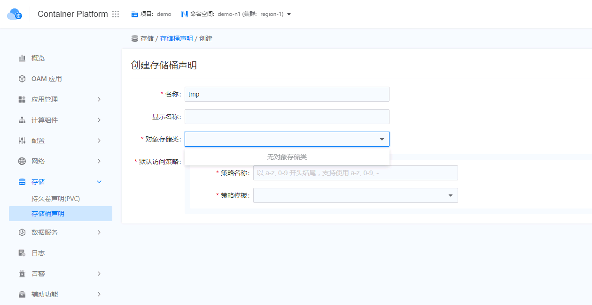
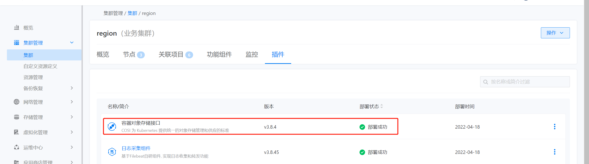
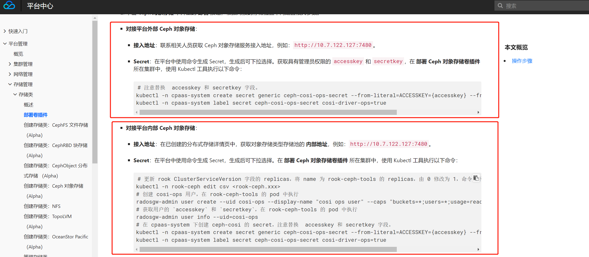

---
kind:
  - Troubleshooting
products:
  - Alauda Container Platform
  - Alauda DevOps
  - Alauda AI
  - Alauda Application Services
  - Alauda Service Mesh
  - Alauda Developer Portal
ProductsVersion:
  - 4.1.0,4.2.x
---
<!-- A type of document that involves encountering a fault, diagnosing it, performing root cause analysis, and providing solutions. -->

# 创建存储统声明无对象存储类可进行选择

创建存储统声明无对象存储类可进行选择

## Cause
- 未对接对象存储类
- 未部署容器对象存储接口插件-COSI
- 未部署Ceph对象存储卷插件

## Resolution
- 完成对象存储对接
- 在集群插件中心部署COSI插件
- 部署Ceph对象存储卷插件

## [workaround]

## [Related Information]
**Screenshots**

****
****
- Environment: 3.8, 3.8.1
- 容器对象存储接口插件-COSI
- Ceph对象存储卷插件
- 存储类配置
- Component: Ceph
- Page ID: 115517463
- Original Title: 容器平台-创建存储统声明无对象存储类可进行选择
