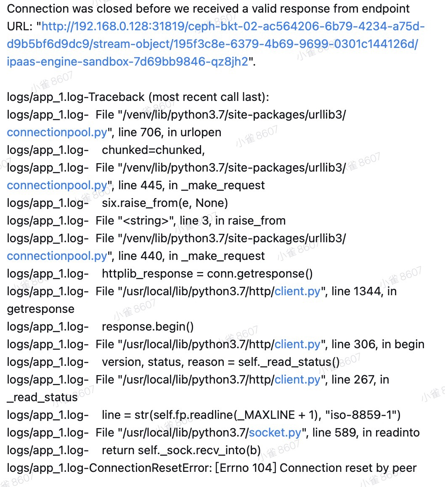
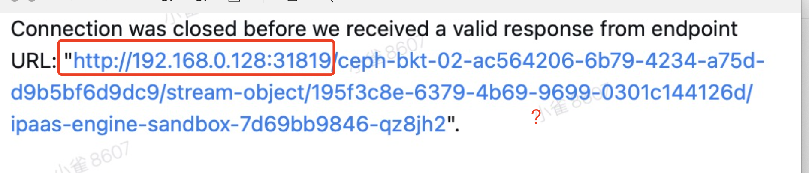

---
kind:
  - Troubleshooting
products:
  - Alauda Container Platform
  - Alauda DevOps
  - Alauda AI
  - Alauda Application Services
  - Alauda Service Mesh
  - Alauda Developer Portal
ProductsVersion:
  - 4.1.0,4.2.x
---
<!-- A type of document that involves encountering a fault, diagnosing it, performing root cause analysis, and providing solutions. -->

# 业务应用读取ceph内文件偶现断链

业务应用读取ceph内文件偶现断链 1/4概率偶现 每次读取的文件不同

## Cause

## Resolution
- 使用第三方s3工具（如s3cmd、Fileon插件）测试读取文件
- 在调用阶段添加retry方式

## [workaround]

## [Related Information]
**Screenshots**

- Environment: 通用
- s3cmd
- Fileon插件
- /stream-object/
- retry方式
- Component: Ceph
- Page ID: 119080633
- Original Title: 业务应用读取ceph内文件偶现断链
