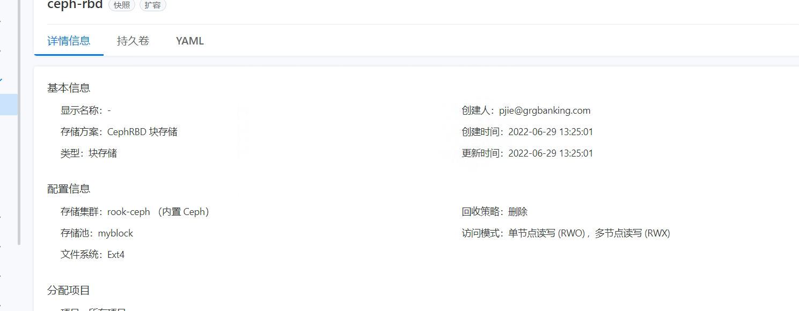
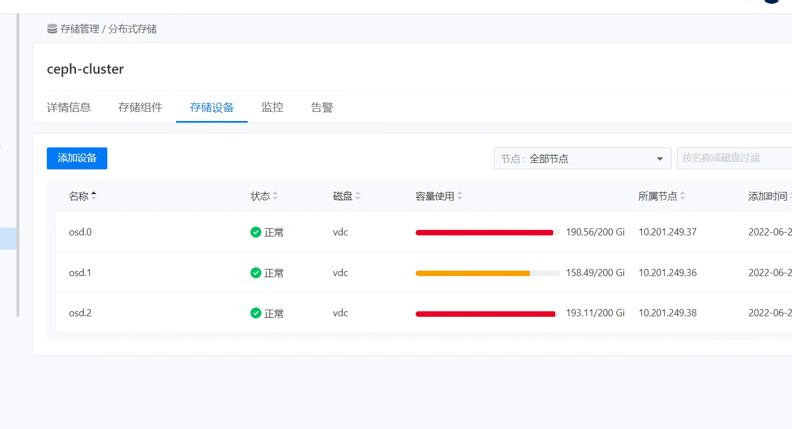
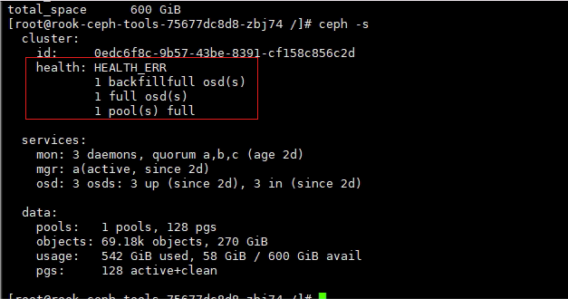
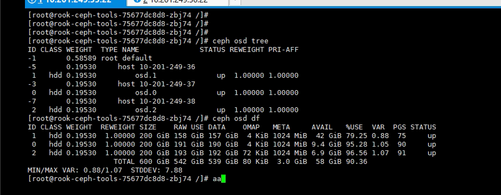

---
kind:
  - Troubleshooting
products:
  - Alauda Container Platform
  - Alauda DevOps
  - Alauda AI
  - Alauda Application Services
  - Alauda Service Mesh
  - Alauda Developer Portal
ProductsVersion:
  - 4.1.0,4.2.x
---
<!-- A type of document that involves encountering a fault, diagnosing it, performing root cause analysis, and providing solutions. -->

# ceph块存储删除旧pv不释放空间导致无法创建新的pv

无法创建新的PV ceph集群状态异常 osd存储占满

## Cause
- osd存储使用率超过mon osd full ratio默认阈值0.95

## Resolution
- 停止新数据写入
- 临时调高mon osd full ratio到0.97: ceph osd set-nearfull-ratio 0.97; ceph osd set-backfillfull-ratio 0.97; ceph osd set-full-ratio 0.97
- 监控集群状态恢复: watch -n 1 ceph -s
- 恢复默认阈值: ceph osd set-nearfull-ratio 0.85; ceph osd set-backfillfull-ratio 0.95; ceph osd set-full-ratio 0.95

## [workaround]
- 临时调整mon osd full ratio参数

## [Related Information]
**Screenshots**

- Environment: 3.8.1
- ceph块存储
- osd
- mon osd full ratio
- mon osd nearfull ratio
- mon osd backfillfull ratio
- Component: Ceph
- Page ID: 119088047
- Original Title: ceph块存储删除旧pv不释放空间导致无法创建新的pv
