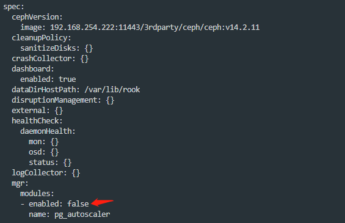
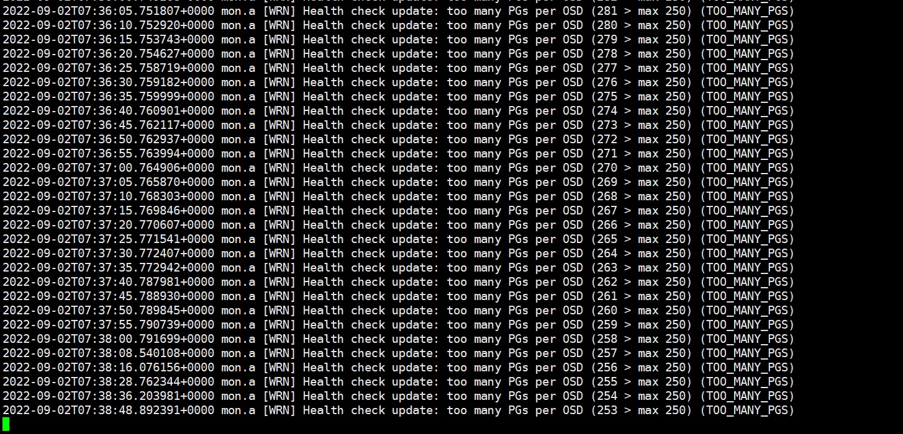

---
kind:
  - Troubleshooting
products:
  - Alauda Container Platform
  - Alauda DevOps
  - Alauda AI
  - Alauda Application Services
  - Alauda Service Mesh
  - Alauda Developer Portal
ProductsVersion:
  - 4.1.0,4.2.x
---
<!-- A type of document that involves encountering a fault, diagnosing it, performing root cause analysis, and providing solutions. -->

# 如何调整和设置ceph pool的pg和pgp

osd磁盘占用不均衡 ceph性能下降 too many PGs per OSD (xxx > max 250) 警告

## Cause
- pg_num/pgp_num设置过少导致存储不均衡
- pg_num/pgp_num设置过多导致性能下降
- 未关闭pg_autoscaler自动配置

## Resolution
- 关闭pg_autoscaler: edit cephcluster资源并禁用
- 根据公式 (OSDs * 100)/pool_size 计算Total PGs，取最接近2的N次方
- 设置pg_num/pgp_num: ceph osd pool set <pool> pg_num <value>; ceph osd pool set <pool> pgp_num <value>
- 推荐值: 少于5个OSD设128，5-10个OSD设512，10-50个OSD设1024，超过50个OSD使用pgcalc工具计算
- 调整多个pool时需综合考虑总PG数避免超过OSD承载

## [workaround]
- 临时调整mon_pg_warn_max_per_osd参数值

## [Related Information]
**Screenshots**

- Environment: 通用
- ceph osd pool set
- pgcalc
- cephfs_data
- cephfs_metadata
- mon_pg_warn_max_per_osd
- pg_autoscaler
- Component: Ceph
- Page ID: 124682867
- Original Title: 如何调整和设置ceph pool的pg和pgp
