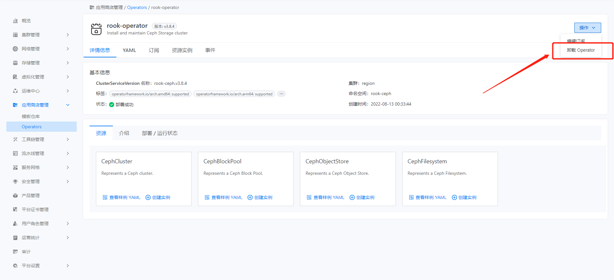

---
kind:
  - Troubleshooting
products:
  - Alauda Container Platform
  - Alauda DevOps
  - Alauda AI
  - Alauda Application Services
  - Alauda Service Mesh
  - Alauda Developer Portal
ProductsVersion:
  - 4.1.0,4.2.x
---
<!-- A type of document that involves encountering a fault, diagnosing it, performing root cause analysis, and providing solutions. -->

# 3.8

JIRA Jira：

## Cause

## Resolution
- 删除所有使用 rook-ceph 存储的 PVC/PV 资源
- 删除存储相关的 StorageClass
- 删除所有存储池
- 执行 CephCluster 清理命令：kubectl -n rook-ceph patch cephcluster ceph-cluster --type merge -p '{"spec":{"cleanupPolicy":{"confirmation":"yes-really-destroy-data"}}}'
- 删除 CephCluster：kubectl -n rook-ceph delete cephcluster ceph-cluster
- 验证清理完成：kubectl get pod -n rook-ceph | egrep "mon|mgr|osd"
- 卸载 rook-operator
- 检查残留资源：kubectl get csv -A
kubectl get installplans.operators.coreos.com -A
kubectl get subscriptions.operators.coreos.com -A

## [workaround]

## [Related Information]
**Screenshots**

- Environment: 3.8.x
- rook-ceph
- CephCluster
- StorageClass
- 存储池
- csv
- installplans.operators.coreos.com
- subscriptions.operators.coreos.com
- Component: Ceph
- Page ID: 124683399
- Original Title: 3.8-卸载rook-ceph
