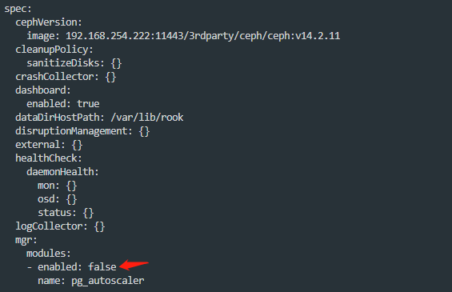
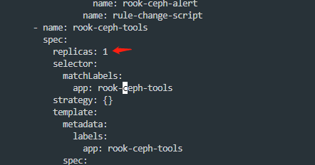

---
kind:
  - Troubleshooting
products:
  - Alauda Container Platform
  - Alauda DevOps
  - Alauda AI
  - Alauda Application Services
  - Alauda Service Mesh
  - Alauda Developer Portal
ProductsVersion:
  - 4.1.0,4.2.x
---
<!-- A type of document that involves encountering a fault, diagnosing it, performing root cause analysis, and providing solutions. -->

# rook ceph 手动调整 pg 数量

需要手动调整PG数量时自动调整功能未关闭 pool的pg_autoscale_mode处于开启状态

## Cause
- pg_autoscaler功能未禁用
- pool自动扩展模式未关闭

## Resolution
- 修改CephCluster资源关闭pg_autoscaler
- 调整rook-ceph-tools的CSV副本数为1
- 在rook-ceph-tools容器内执行：ceph osd pool set <pool-name> pg_autoscale_mode off
- 通过ceph osd pool set命令手动设置pg_num/pgp_num

## [workaround]

## [Related Information]
**Screenshots**

- Environment: Rook Ceph
- CephCluster.spec.disruptionManagement.pg_autoscaler
- rook-ceph-tools.csv
- ceph osd pool ls
- ceph osd pool set
- ceph osd pool autoscale-status
- Component: Ceph
- Page ID: 124686215
- Original Title: rook ceph 手动调整 pg 数量
