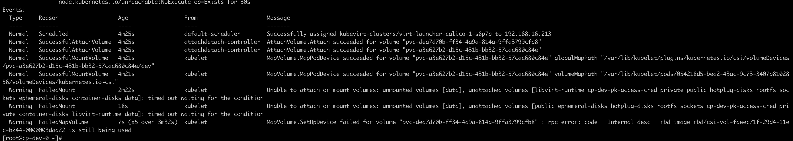

---
kind:
  - Troubleshooting
products:
  - Alauda Container Platform
  - Alauda DevOps
  - Alauda AI
  - Alauda Application Services
  - Alauda Service Mesh
  - Alauda Developer Portal
ProductsVersion:
  - 4.1.0,4.2.x
---
<!-- A type of document that involves encountering a fault, diagnosing it, performing root cause analysis, and providing solutions. -->

# 基础设置

pod 一直处于 Create 状态 describe 显示 rbd mount 不上

## Cause
- rbd 在其他节点上没有被正确 unmap
- VM 内部使用 ceph 磁盘又做了一层 ceph 集群或作为 docker 目录
- 强制删除后重启节点遇到 pv 仍在使用提示

## Resolution
- 通过 rbd status <image> 命令定位 mapped 节点
- kubectl -n rook-ceph get po -l app=csi-rbdplugin 获取对应节点上的 pod
- kubectl exec 进入 csi-rbdplugin 容器执行 rbd device list | grep <image> 获取 mapped 设备
- 执行 rbd unmap <device_path> 解除映射
- 遇到 busy 时检查挂载点并执行 umount/dmsetup remove，或使用 rbd unmap -o force

## [workaround]
- 使用 rbd unmap -o force 强制卸载

## [Related Information]
**Screenshots**

- Environment: Kubernetes 集群中使用 Ceph RBD（通过 Rook Ceph 部署）
- csi-vol-faeec71f-29d4-11ec-b244-0000003dad22
- csi-rbdplugin
- /dev/rbd6
- rbd status
- rbd device list
- rbd unmap
- Component: Ceph
- Page ID: 124693225
- Original Title: 基础设置-ceph-手动卸载 rbd
