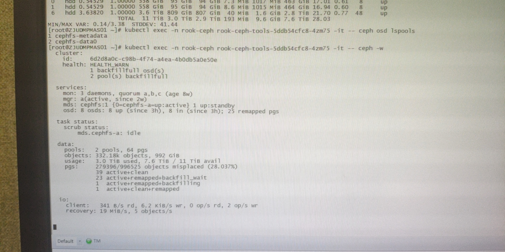
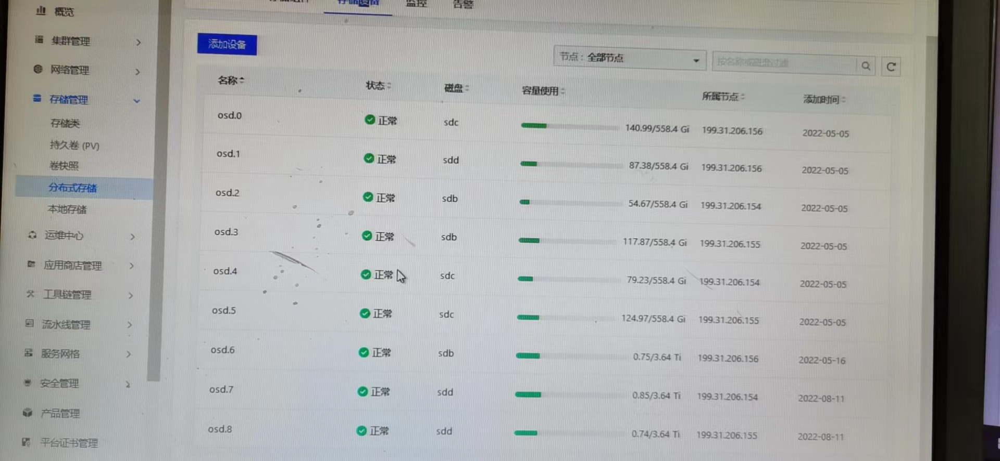

---
kind:
  - Troubleshooting
products:
  - Alauda Container Platform
  - Alauda DevOps
  - Alauda AI
  - Alauda Application Services
  - Alauda Service Mesh
  - Alauda Developer Portal
ProductsVersion:
  - 4.1.0,4.2.x
---
<!-- A type of document that involves encountering a fault, diagnosing it, performing root cause analysis, and providing solutions. -->

# 3.8.1

ceph部分osd空间使用率异常 集群变为不可写状态 磁盘数据不均衡

## Cause
- pg数量太少导致数据分布不均

## Resolution
- kubectl -n rook-ceph edit cephcluster ceph-cluster 关闭pg_autoscale
- ceph osd pool set noautoscale
- ceph osd pool set cephfs-metadata pg_autoscale_mode off
- ceph osd pool set cephfs-data0 pg_autoscale_mode off
- ceph osd pool set cephfs-metadata pg_num 128
- ceph osd pool set cephfs-metadata pgp_num 128
- ceph osd pool set cephfs-data0 pg_num 128
- ceph osd pool set cephfs-data0 pgp_num 128

## [workaround]

## [Related Information]
**Screenshots**
2、使用tools工具执行ceph -w命令返回结果
等待所有pg 变成 active+clean，osd使用率恢复正常
- Environment: 3.8.1
- pg_autoscale_mode
- cephfs-metadata
- cephfs-data0
- ceph -w
- ceph osd pool set
- Component: Ceph
- Page ID: 124696617
- Original Title: 3.8.1-容器平台-ceph 单个osd使用率异常
