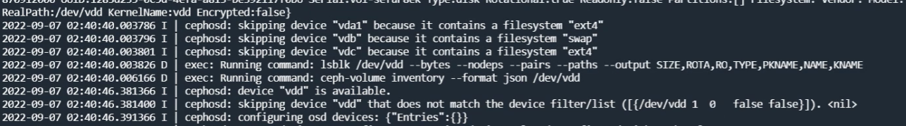
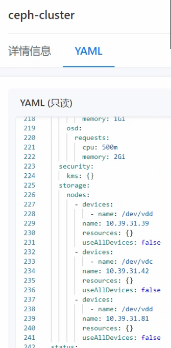

---
kind:
  - Troubleshooting
products:
  - Alauda Container Platform
  - Alauda DevOps
  - Alauda AI
  - Alauda Application Services
  - Alauda Service Mesh
  - Alauda Developer Portal
ProductsVersion:
  - 4.1.0,4.2.x
---
<!-- A type of document that involves encountering a fault, diagnosing it, performing root cause analysis, and providing solutions. -->

# 3.4.2

rook-ceph创建后告警 无法创建PV

## Cause
- OSD配置中磁盘名称错误地包含/dev前缀

## Resolution
- 修改cephcluster配置，将磁盘名称改为具体磁盘名称(如sdb)而非/dev/sdb格式

## [workaround]

## [Related Information]
**Screenshots**
1、检查rook-ceph prepare组件pod日志发现磁盘名称填写错误
2、配置osd时磁盘名称填写错误，需要直接写磁盘名称，不需要加/dev
- Environment: 3.4.2
- rook-ceph prepare组件
- CephCluster CR配置
- OSD配置项
- disks配置键
- Component: Ceph
- Page ID: 127409170
- Original Title: 3.4.2-容器平台-rook-ceph创建失败
